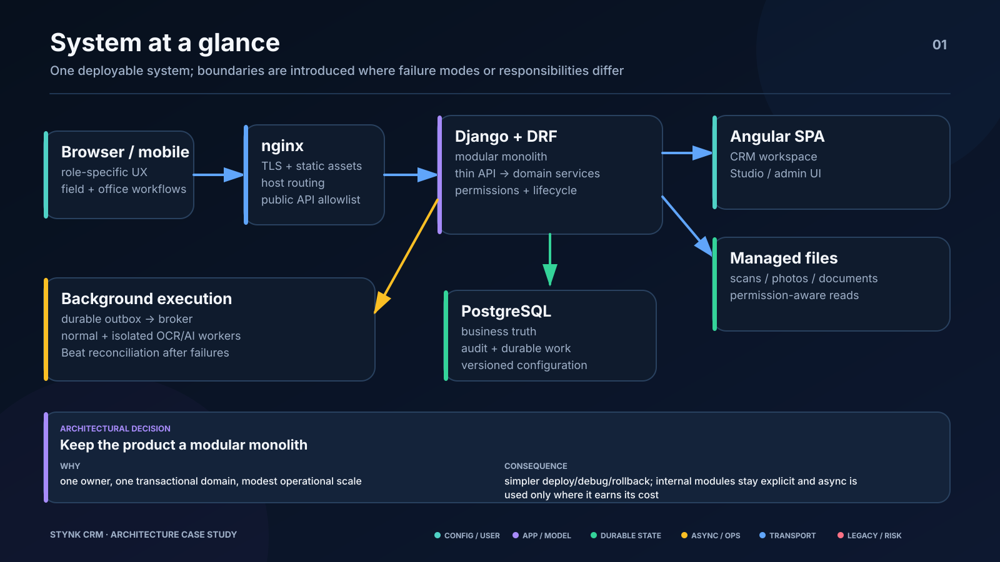
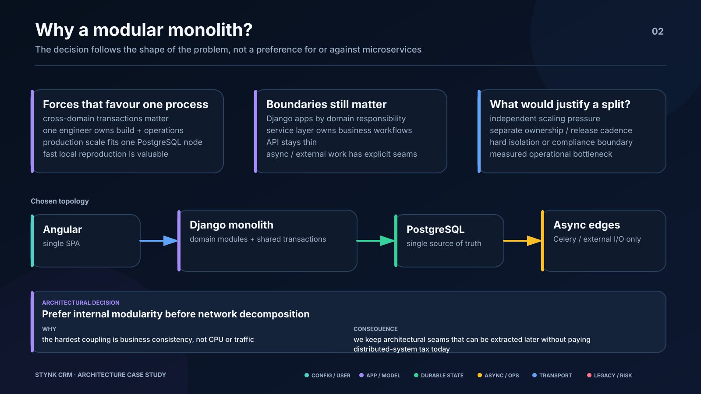
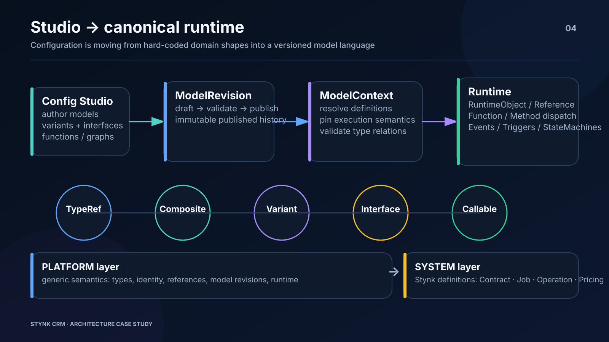
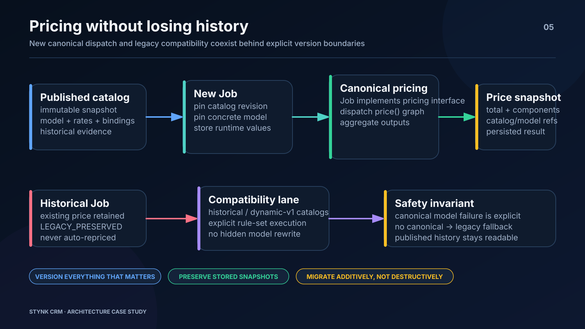
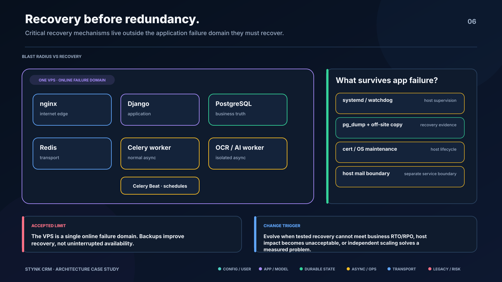
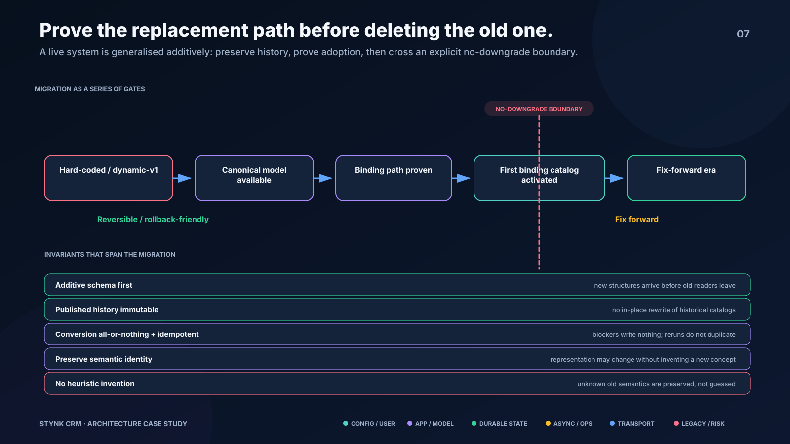

# Stynk CRM — architecture slides

These diagrams are a sanitized visual companion to the [Stynk CRM case study](STYNK_CRM.md).

They are based on the current private-project architecture, but intentionally omit source code, credentials, client data and proprietary business configuration. The point is to show the engineering decisions and boundaries rather than publish an implementation blueprint.

## 1. System at a glance

A deliberately modular monolith: Angular and Django/DRF share one deployable application boundary, while PostgreSQL remains the durable source of business state and asynchronous execution stays behind explicit worker/broker boundaries.

## 2. Inside the modular monolith

The system keeps complexity in domain/service boundaries rather than distributing it across network services. Contracts, Jobs, pricing, payments, sales visits, attachments, OCR and audit live as distinct modules but share one transactional model.

## 3. Reliable background work

Celery executes work; it does not define whether the work exists. Durable `DomainWorkItem` state lives in Django/PostgreSQL, identifiers are enqueued after commit, Redis is transport, and Celery Beat reconciles pending work after failures.

## 4. Studio to canonical runtime

The current generalisation work separates a generic Platform language/runtime from Stynk-specific System definitions. Studio-authored models become versioned `ModelRevision` / `ModelContext` data that can drive typed runtime objects, references, callable behaviour and automation.

## 5. Pricing without losing history

Published catalogs are immutable historical evidence. New Jobs pin a concrete model/catalog revision and persist pricing snapshots; older catalogs continue through an explicit compatibility lane and historical Jobs are never silently re-priced.

## 6. Production topology

Production intentionally fits on one Linux VPS: nginx, Django, PostgreSQL, Redis, workers and Beat run in Docker Compose, while host-level supervision, backups, certificates and recovery remain outside the application queue so they survive application failure.

## 7. Evolution without a rewrite

The project is being generalized in place: hard-coded Job/pricing semantics first moved into configurable/versioned models, then toward a canonical type/runtime layer. The migration rule is additive — explicit adapters, pinned revisions and preserved historical semantics instead of a big-bang rewrite.

---

The diagrams are intentionally simplified. The private repository remains the source of truth for exact implementation details and transition state.
