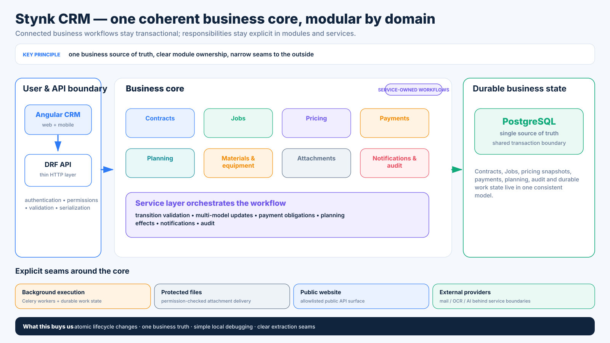
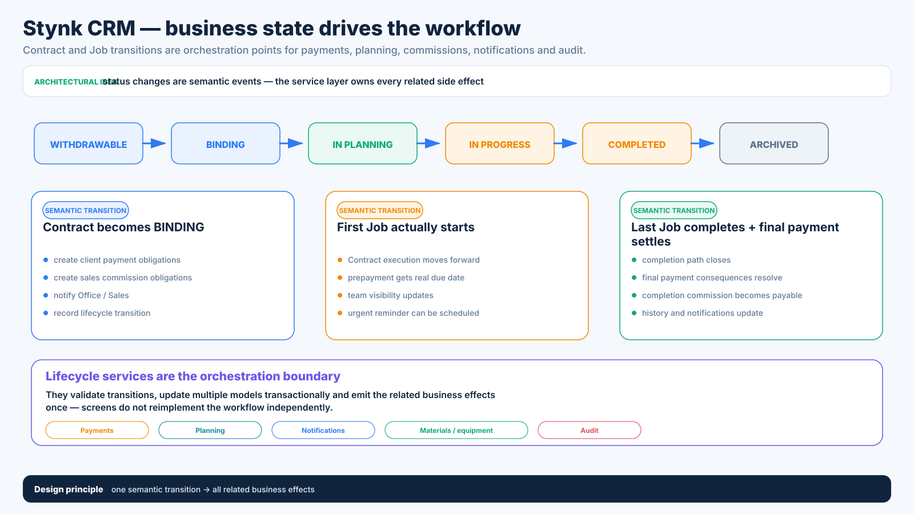
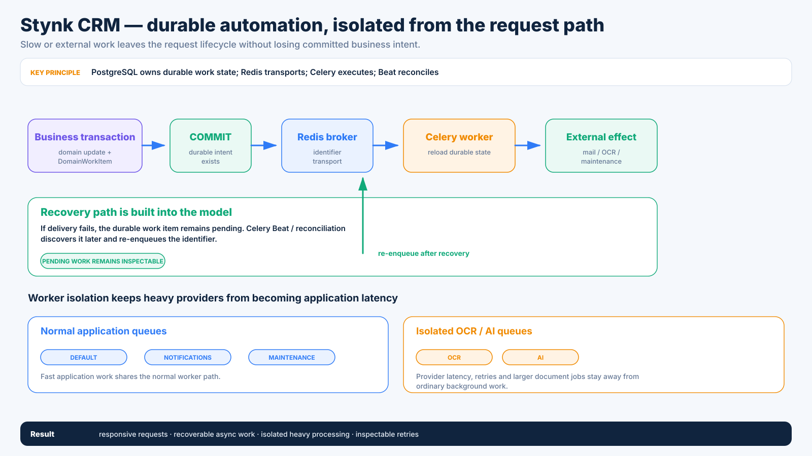
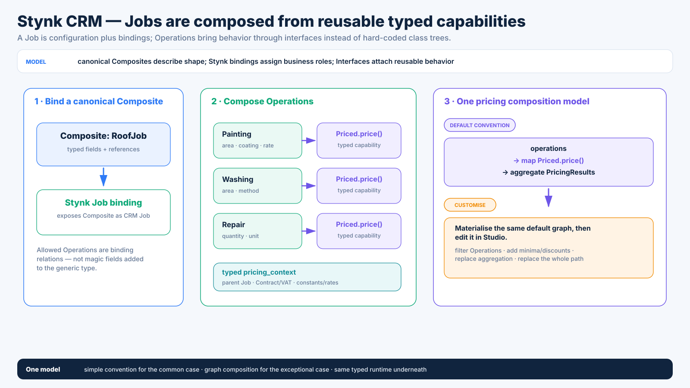
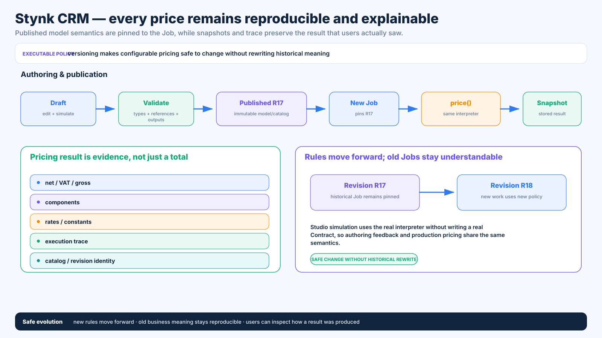
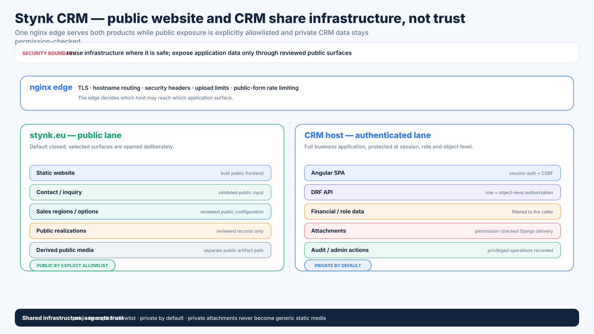

# Stynk CRM — architecture slides

These diagrams are a sanitized visual companion to the [Stynk CRM case study](STYNK_CRM.md).

> **Narrative source:** [STYNK_ARCHITECTURE_CONTENT_SPEC.md](STYNK_ARCHITECTURE_CONTENT_SPEC.md) is the content source of truth. The slide set is capability-first: each diagram starts from something the system enables, then shows the architectural mechanism behind it.

They are derived from the current private-project architecture, but intentionally omit source code, credentials, client data and proprietary business configuration.

## 1. One coherent business core, modular by domain

Contracts, Jobs, pricing, payments, planning, notifications and audit remain in one transactional business system. Responsibility boundaries live in domain modules and services; background execution, files and public integrations leave through explicit seams.

## 2. Business state drives the workflow

Lifecycle transitions are orchestration points, not cosmetic status labels. A Contract becoming binding, a Job actually starting or the final Job completing can update payments, planning, commissions, notifications and audit through one controlled service-layer workflow.

## 3. Durable automation outside the request path

Business-significant background work is anchored in durable PostgreSQL state before Redis/Celery transport. The normal worker path is separated from OCR/AI queues, and reconciliation can rediscover committed work after delivery failures.

## 4. Reusable Platform kernel, explicit Stynk bindings

The generic layer owns reusable semantics such as types, identity, references, callable execution, events/state machines and revision resolution. Stynk-specific roles such as Job bindings, pricing context and CRM lifecycle integration stay in the System layer.

## 5. Jobs composed from reusable typed capabilities

Canonical Composites can be exposed as Stynk Jobs through bindings. Operations implement a reusable `Priced.price()` capability, receive typed pricing context and are composed into the Job result through the same graph runtime used for custom logic.

## 6. Every price remains reproducible and explainable

Published model/catalog semantics are immutable and Jobs stay pinned to the revision that priced them. Snapshots, components and execution trace preserve both the business result and the explanation behind it while new revisions move forward.

## 7. Public website and CRM share infrastructure, not trust

The public site and CRM share nginx infrastructure but not one trust zone. Public APIs/media are explicitly allowlisted, while the CRM remains session-authenticated, role/object-filtered and permission-checks private attachments through Django.

---

The diagrams are intentionally simplified. The private repository remains the source of truth for exact implementation details and transition state.
