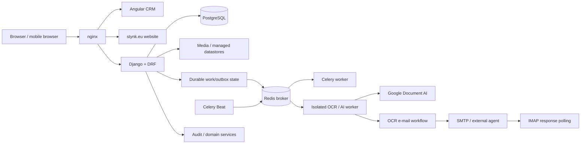

# Stynk CRM — end-to-end product / systems case study

> **Source:** proprietary / private  
> **Role:** solo software engineer / de facto end-to-end IT owner  
> **Domain:** construction services, field sales, contracts, jobs and operational planning

Stynk CRM is the project where my role expanded furthest beyond "developer".

I own the path from an informal business process to a running production system:

```text
business conversation
        ↓
requirements / domain model
        ↓
architecture
        ↓
UX and workflow design
        ↓
backend + frontend
        ↓
verification / CI
        ↓
deployment / rollback
        ↓
production support and iteration
```

This document describes the architecture and selected workflows without publishing client source code, credentials, personal data or proprietary business configuration.

See also: [recommended screenshots for this case study](STYNK_SCREENSHOTS.md).

---

## 1. The problem

Before the CRM, operational information was spread between paper contracts, local spreadsheets, Google Drive, e-mail, WhatsApp and verbal hand-offs.

That is manageable while the organization is small, but it creates recurring failure modes as work volume grows:

- the same information exists in several places;
- updates do not propagate reliably;
- office, sales and field teams see different versions of the same job;
- contract details have to be retyped from paper;
- deadlines and commissions depend on people remembering the process;
- technical photos and notes are detached from the work they describe;
- planning depends too much on individual memory;
- historical reconstruction becomes difficult when something goes wrong.

The goal was therefore not "build a client database".

The goal was to turn a real operating process into one explicit, auditable system while keeping it simple enough that one technical owner can maintain it.

---

## 2. Business workflow modelled by the system

A simplified contract flow looks like this:

```text
field sales visit
      ↓
paper contract signed on site
      ↓
sales rep uploads scans / photos / notes
      ↓
office intake and structured data entry
      ↓
withdrawal period
      ↓
contract becomes legally binding
      ↓
payments / sales commission obligations
      ↓
job planning + subcontractor assignment
      ↓
calendar / resource coordination
      ↓
field execution
      ↓
client payments + final commissions
      ↓
completion / settlement / archive
```

The CRM models this as actual lifecycle state rather than a collection of unrelated forms.

For example:

- a contract uploaded by Sales starts in office intake;
- once required structured data and at least one Job exist, it can move into the withdrawal/legal phase;
- after the withdrawal deadline the contract can become binding automatically;
- binding creates payment/commission obligations;
- assigning and scheduling Jobs drives planning;
- the first actual Job start moves execution forward and activates the client prepayment due date;
- finishing the last Job moves the contract toward completion;
- the final sales commission becomes payable only when the required job-completion and client-payment conditions are both satisfied;
- cancellation propagates into Jobs and remains visible in audit history.

This is the kind of domain logic that made the project much more interesting than CRUD.

---

## 3. System architecture

The application deliberately remains a **modular monolith**.

That is an architectural choice, not an unfinished microservice migration.

The current production shape is roughly:



The core stack is:

- Angular frontend;
- Django + Django REST Framework backend;
- PostgreSQL in production;
- nginx as the public reverse proxy/static server;
- gunicorn for Django;
- Docker Compose for the application stack;
- Celery + Redis for application background work;
- Celery Beat with database-backed schedules;
- local/managed file storage with an extension seam for external datastores.

The backend is split into Django apps aligned with domain responsibilities such as accounts, clients, contracts, Jobs, pricing, payments, attachments, OCR, sales and analytics.

The service layer owns business processes; API views are intended to remain relatively thin.

### Why a monolith here?

The technical requirements explicitly favor:

- a small number of technologies;
- standard approaches;
- one-person maintainability;
- straightforward local development;
- reproducible testing and deployment;
- one repository containing application code, deployment automation and documentation.

The business has enough complexity to justify strong internal boundaries, but not enough operational scale to justify distributed-system complexity for its own sake.

---

## 4. Background work: Celery as execution, Django as truth

One architectural rule I care about in this system is that **the task queue is not the business database**.

Redis is used as a Celery broker, but durable work state lives in Django/PostgreSQL.

The current worker topology separates ordinary background work from heavier or externally dependent OCR/AI work:

```text
normal worker
  ├─ default
  ├─ notifications
  └─ maintenance

isolated worker
  ├─ ocr
  └─ ai

Celery Beat
  └─ database-backed periodic schedules
```

The Celery result backend is intentionally disabled.

For business-significant work, durable Django rows and an outbox-style boundary carry identifiers into the queue **after the database transaction commits**.

That gives the system several useful properties:

- a Redis outage does not erase the knowledge that work still needs to happen;
- Beat/reconciliation can rediscover pending work;
- background jobs do not need to contain contract contents, credentials or other business truth in broker payloads;
- application state can be inspected through normal Django/admin models rather than reconstructed from a queue;
- host-level responsibilities such as backups, certificate renewal and Docker watchdogs remain outside Celery so they still work when the application stack is unhealthy.

Redis persistence and broker failure are still treated as real operational concerns; the architecture simply avoids pretending the broker is the source of record.

---

## 5. OCR: two providers, one review-first contract

Contract intake is one of the clearest examples of the system trying to remove repetitive office work without giving automation too much authority.

Only contract/annex scan attachments are eligible for OCR.

The system supports two provider modes.

### 5.1 Google Document AI

The direct provider path can use Google Document AI.

Important boundaries:

- OCR is disabled by default;
- provider/project/processor settings are admin-controlled;
- credentials can come from deployment secrets or an admin-managed encrypted credential record;
- credentials are never returned through the normal API or placed in generic Preferences;
- monthly page budget can be reserved before provider execution;
- transient provider errors can be retried;
- output is stored as reviewable text/suggestions;
- OCR **does not silently rewrite Contract, Client, financial, commission or Job data**.

The extraction model is versioned and explicitly defines expected fields/types and confidence.

The contract is therefore:

```text
scan
  ↓
extract
  ↓
normalize / confidence
  ↓
human review
  ↓
explicit application
```

—not "AI saw a number, therefore the database now contains it".

### 5.2 E-mail OCR workflow

The alternative e-mail provider is one of my favourite integrations in the project because it treats unreliable external communication as a workflow instead of a single API call.

When an eligible scan is committed:

1. the database gets a durable per-attachment delivery marker;
2. only **after commit** is an OCR task enqueued;
3. the worker locks the logical Contract and freezes pending scans into one durable batch;
4. the batch receives a correlation ID and deterministic `Message-ID`;
5. one message is sent with subject `OCR: #<contract-number>`, the relevant scans and the extraction model;
6. SMTP acceptance changes the batch state to `SENT`;
7. the worker finishes — it does **not** sit around waiting for OCR.

A separate recovery worker periodically repairs stale/pending delivery state and re-enqueues work when necessary.

A third worker polls the configured mailbox over IMAP. It keeps a durable UID cursor and correlates replies primarily through `In-Reply-To` / `References` against the deterministic message ID.

This makes the asynchronous chain roughly:

```text
upload transaction
       ↓ commit
durable attachment delivery
       ↓
immediate Celery send
       ↓
durable OCR batch
       ↓
SMTP message
       ↓
external OCR agent
       ↓
reply e-mail
       ↓
IMAP cursor / correlation
       ↓
RESPONSE_RECEIVED
       ↓
future parse / validate / review
```

The workflow is deliberately honest about the SMTP crash window: SMTP cannot provide strict distributed exactly-once semantics across "remote server accepted mail" and "local database committed sent_at".

Instead of hiding that, the design uses:

- stable batch identity;
- stable `Message-ID`;
- DB locking/leases;
- idempotent response processing;
- positive evidence from an actual OCR reply.

Transport and interpretation of the OCR result are separate concerns.

That separation is particularly important because a successful message delivery is not the same thing as a trustworthy business-data update.

---

## 6. Frontend: responsive workflow UI, not a shrunk desktop

The frontend is Angular with a shared component layer and theme-aware SCSS.

The UI direction is deliberately restrained: dark/day themes, whitespace-based separation, consistent typography, small interaction feedback and reusable layout primitives rather than feature screens inventing their own visual system.

Shared primitives include, among others:

- `PanelShell` for top-level surfaces;
- `SectionHeader`;
- `ActionBar`;
- responsive `FormGrid`;
- `MetaTable` and simpler table primitives;
- reusable form field/input components;
- address/contact/identity panels;
- map-assisted address input;
- attachment gallery;
- shared note/comment cards;
- shared lock/edit patterns.

### Phone portrait mode

One important UX lesson was that "responsive" does not mean taking a desktop composition and continuously making it narrower.

For phone portrait, the application has dedicated presentation behaviour.

The shared shell supports `phonePortraitFlat` and `phonePortraitBleed`, and the current code uses that pattern in screens including:

- contract editor;
- Job detail;
- client editor;
- user management;
- subcontractor calendar;
- payment detail.

There is also explicit `max-width: 480px` handling across shared and feature styles.

The phone-oriented design flattens nested panel/card chrome, gives actual content more width, stacks label/value pairs, changes dense tables into card-like presentations where appropriate, makes attachment/note actions touch-friendly and avoids horizontal scrolling.

This matters because Sales and subcontractor workflows are naturally used away from an office desk.

---

## 7. Selected product features

The full system contains many small workflows; these are the ones I think best illustrate its character.

### 7.1 Contract intake and office hand-off

Sales representatives can upload paper-contract scans/photos plus attachments and notes.

Office receives the pending Contract, reviews the scanned source and enters/validates structured data.

The workflow intentionally retains the original evidence next to the normalized business record.

OCR can assist this process, but it remains review-first.

### 7.2 Job lifecycle and pricing

A Contract contains one or more Jobs.

Jobs have their own lifecycle and can be:

- planned;
- assigned to subcontractors;
- started;
- completed;
- cancelled/settled according to workflow.

The system connects operational state to financial and planning consequences rather than making users reproduce those links manually.

### 7.3 Scheduling and overbooking

The planning calendar is derived from Job data rather than maintaining a second calendar database.

Office can assign subcontractors and planned dates; the system can detect date overlap between different Contracts and surface an overbooking warning while still allowing an explicit override.

The calendar supports global/subcontractor-oriented planning and uses lifecycle state to communicate work status.

### 7.4 Mobile-first field sales visits

The Sales Visit module uses a reusable:

```text
city → street → building number → visit history
```

hierarchy optimized for repeated field work.

It supports:

- repeated visits to one address;
- notes/photos;
- ownership and role permissions;
- edit locks;
- visit type/contact channel/result status;
- month/week/day calendar views;
- status-colored visit bars;
- map view for on-site meetings;
- location/map-assisted address entry;
- linking an existing Client or creating a partial Client from a meeting flow;
- completion flow with an optional quick note.

This is a good example of domain-specific UX that would be awkward to force into a generic "activities" table.

### 7.5 Public website → CRM lead flow

The public `stynk.eu` contact form is not just an e-mail form.

A valid request is first persisted as a durable CRM `PublicInquiry`.

The workflow includes:

- server-side validation;
- honeypot handling;
- optional images;
- postal-region lookup;
- preferred adviser validation;
- fallback assignment/round-robin within a region;
- in-app notification;
- durable mail delivery state;
- asynchronous SMTP after commit;
- retry handling;
- lead reassignment/decline;
- audited conversion into a Client;
- idempotent meeting creation.

The HTTP response does not wait for SMTP.

That means an SMTP outage does not turn a valid lead into lost browser state.

### 7.6 Audit history

Business audit is separate from technical logging.

For enabled entity/action families, the system records:

- who changed something;
- when;
- entity type and identity;
- before/after data;
- action type.

Some UI audit timelines expand one logical object into related records, so the system can reconstruct meaningful history even when a related entity was later deleted.

Raw audit tooling is admin-only.

### 7.7 Managed file storage

Attachments started on local media storage, but the current storage layer introduces a managed datastore seam.

A managed file permanently records which physical datastore/provider locator owns it.

New writes can select the current preferred datastore, while reads continue to resolve through the stored location rather than assuming that "today's preferred datastore" also contains yesterday's files.

The current implementation supports local storage and Google Drive with encrypted OAuth refresh credentials; the same interface leaves room for an S3-compatible backend later without changing Contract/Attachment business models.

---

## 8. Config Studio and the move away from hard-coded pricing

The biggest architectural evolution in the system is the move from hard-coded Job/pricing types toward a configurable model.

The long-term direction is not to build "a pricing form builder".

It is to let the system describe more of its own business model using:

- typed resources;
- canonical composite types;
- fields and TypeRefs;
- interfaces/methods;
- Job / Operation application bindings;
- callable graphs;
- constants/rates;
- versioned/published catalogs.

A Job can expose Operations as first-class CRM rows while pricing executes through a pinned model/catalog context.

Published catalogs are treated as historical evidence: they are immutable rather than silently reinterpreted after configuration changes.

The 3.0.1 binding direction intentionally separates:

```text
generic model language
        ↓
Stynk application binding
        ↓
CRM Job / Operation runtime
        ↓
pricing policy
```

instead of making "Job" and "Operation" fundamental concepts of the generic type system.

The Studio UI is correspondingly more like a small modelling environment than a conventional settings screen: explorer, editor, inspector, diagnostics/dock, model resources and graph-based callable authoring share one workspace.

This is also where the codebase is being generalized into a reusable technical skeleton without forcing Stynk-specific semantics into the generic layer.

---

## 9. Event / automation architecture under the Studio layer

The generalized platform work goes beyond pricing.

The current architecture defines typed:

- Events;
- Triggers;
- StateMachines;
- callable effects;
- scheduled and incoming-mail trigger sources;
- semantic `object.changed` triggers.

Some design choices I consider important:

- synchronous Event chains execute inside one atomic transaction;
- external/background delivery happens only after commit where appropriate;
- state-machine instances are pinned to a model revision;
- triggers use durable idempotency receipts;
- event chains carry correlation/causation identifiers;
- dispatch depth is bounded to prevent automation loops;
- semantic object changes go through an explicit mutation boundary rather than broad Django `post_save` magic.

This is active platform/generalisation work rather than a claim that every historical CRM workflow has already been rewritten onto that runtime.

---

## 10. Permissions, edit ownership and operational safety

The application has four primary business roles:

- Admin;
- Office;
- Sales Rep;
- Subcontractor.

Permissions are enforced both at route/API level and through object-level filtering.

Several complex edit surfaces use an explicit lock/padlock pattern so two users do not casually overwrite each other's work.

This is especially useful on long forms where "last HTTP request wins" would be a poor concurrency model.

Security/operational boundaries also show up in deployment:

- the public website exposes only an allowlisted subset of CRM APIs;
- private CRM attachments are not exposed through public-site media paths;
- credentials are kept out of browser-visible configuration;
- deployment/install flows run security checks;
- the mail server remains a separate service boundary from the Docker web stack.

---

## 11. Deployment and operations

The production deployment deliberately fits on one Linux VPS.

That keeps the operational burden proportional to the company while still using clear service boundaries:

```text
Ubuntu host
  ├─ Docker Compose
  │   ├─ nginx
  │   ├─ Django/gunicorn
  │   ├─ PostgreSQL
  │   ├─ Redis
  │   ├─ Celery worker
  │   ├─ OCR/AI worker
  │   └─ Celery Beat
  │
  ├─ systemd supervision / watchdog
  ├─ cron-managed host operations
  ├─ backups
  └─ host-managed mail stack (separate boundary)
```

The same repository contains the deployment tooling.

The `./stynk.sh` entrypoint handles development, installation, updates, configuration and status flows.

Staging follows the same deployment model but uses isolated Compose resources/ports so it can coexist with production on the same host.

Backups use PostgreSQL's own `pg_dump` inside the DB container and include revision metadata needed to understand which application/site version a restore belongs to.

The CRM and public website are built/deployed together through nginx while remaining separate hostnames and API/security surfaces.

---

## 12. Engineering the repository for maintainability

A large part of the work is not visible in screenshots.

The repository is structured so that the codebase itself carries operational and architectural knowledge:

- domain model documentation;
- process/lifecycle specifications;
- API/architecture docs;
- deployment runbooks;
- test-environment instructions;
- release-readiness reports;
- migration/runbook documentation;
- CI workflows;
- deterministic manual E2E modules for critical journeys.

The project is also intentionally optimized for coding-agent participation.

That does not mean "let agents change everything".

The useful pattern has been:

```text
authoritative docs
      +
bounded task context
      +
tests / CI / browser evidence
      +
GitHub issues / PRs
      ↓
agent implementation / review
      ↓
human or automated acceptance evidence
```

The objective is to make repository state and verification carry context instead of relying on one giant prompt or one person's memory.

---

## 13. Representative UI screenshots

The best screenshots are not necessarily the prettiest pages.

For this case study I want screenshots that each prove a different architectural/product claim:

1. **Contract editor + scans/attachments** — paper-to-structured-data workflow.
2. **Same Contract or Job detail on a phone-width viewport** — dedicated responsive/field UX.
3. **Scheduling calendar** — operational planning and subcontractor workload.
4. **Sales Visit calendar or map** — mobile field-sales workflow.
5. **Studio graph/model workspace** — configurable modelling/pricing architecture.
6. **OCR review/intake state** — if a useful non-sensitive screen exists.
7. **Audit timeline** — explainability and business history.
8. **Public inquiry → CRM lead detail** — public website / internal CRM integration.
9. **Payments/settlements overview** — lifecycle-generated financial obligations.
10. **Admin Preferences for OCR/background configuration** — optional architecture screenshot, preferably with secrets/IDs redacted.

Detailed capture guidance and suggested filenames are in [STYNK_SCREENSHOTS.md](STYNK_SCREENSHOTS.md).

---

## 14. What I think this project demonstrates

The most important part of this project is not that it uses Angular and Django.

It is that I can own a system across boundaries:

- discover requirements from people who do not speak in software abstractions;
- translate them into an explicit domain model;
- decide where automation is useful and where human confirmation remains necessary;
- design backend and frontend together;
- build responsive workflows for different roles/devices;
- create asynchronous/background processing without making the queue the source of truth;
- integrate external services defensively;
- evolve hard-coded domain logic toward configurable models;
- operate deployments, backups, staging and production support;
- preserve auditability and historical semantics while the model changes;
- structure documentation/tests so another human or coding agent can work safely in the codebase.

This is the project that best represents how I work when I own the whole engineering problem rather than one isolated ticket queue.

---

## Why the source is not public

The repository contains proprietary domain logic, client/business data structures and production-oriented implementation for a real company.

I prefer showing a sanitized architecture/product case study to publishing a toy reconstruction that looks public but is no longer the actual system.
