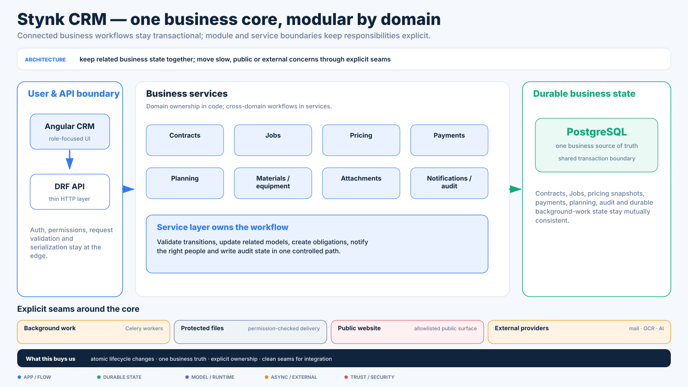
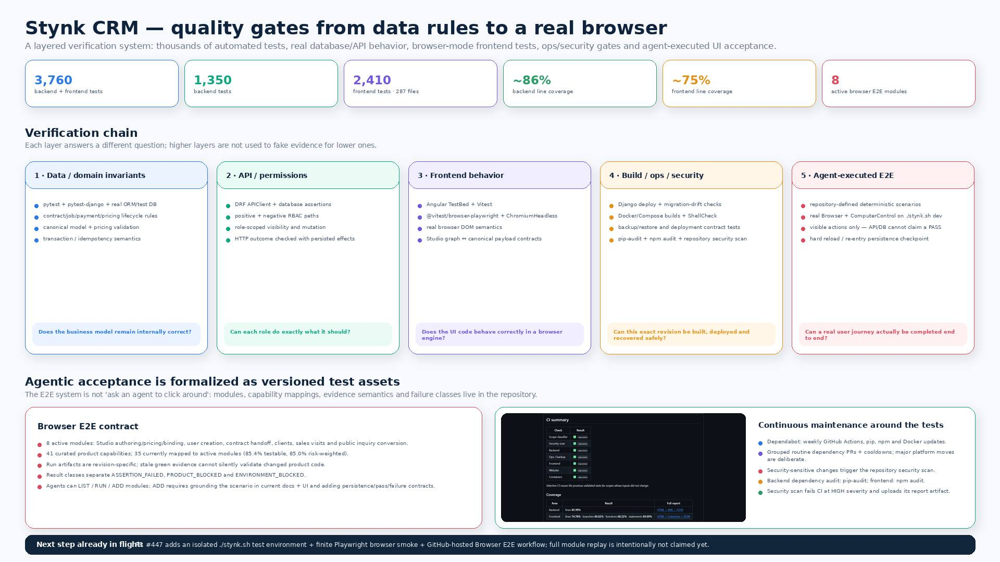

# Stynk CRM — from paper workflow to an executable business system

> **Source:** proprietary / private  
> **Role:** product engineer · system architect · end-to-end technical owner  
> **Domain:** construction services · field sales · contracts · jobs · pricing · operational planning

Stynk started with a deliberately small question: **how do we turn a paper contract signed in the field into usable structured data?**

Production use kept revealing the next missing concept. A form became a Sales → Office hand-off, then a lifecycle/planning/payments system, then configurable Jobs and pricing, and eventually a versioned model/runtime with a visual authoring environment.

## In 30 seconds

| | |
|---|---|
| **Problem** | Business state was split between paper, spreadsheets, Drive, e-mail, WhatsApp and people's memory. |
| **Product** | One role-aware CRM connects field sales, Contracts, Jobs, scheduling, files, payments, commissions, notifications, audit and the public website. |
| **Architecture** | Angular + Django/DRF + PostgreSQL form one modular transactional core; slow/external work leaves through durable async boundaries. |
| **Evolution** | Repeated service/pricing variation moved from hard-coded branches into typed, versioned models, capabilities and executable graphs in Studio. |
| **Engineering model** | Documentation, tests, browser evidence, CI, deployment and production feedback are treated as one feedback system. |

**Recurring pattern:** start from a real operation, make it explicit, let production expose the missing concept, then generalize only when repetition earns the abstraction.


## The story

### 1. A form turned into an operating workflow

The first useful slice was contract capture. Real use showed that the important part was not the form itself, but **who owns the information next and what business consequences follow from state changes**.

Contracts gained lifecycle, Jobs, planning, payment obligations, commissions, notifications and audit because the operating process required them.

[Product & domain →](stynk/product-domain.md) · [Discovery & evolution →](stynk/discovery.md)

### 2. The workflow became one coherent business system

Contracts, Jobs, pricing, payments, planning, notifications and audit stay inside one transactional business core. Slow/external work leaves through explicit durable boundaries instead of becoming a second source of truth.



[Engineering system →](stynk/engineering-system.md)

### 3. Repeated business variation became a modelling problem

As service shapes and pricing rules accumulated, the question changed from *“how do I add another Job type?”* to *“why should changing the business offer require changing application code?”*

The current direction uses canonical typed models, Stynk bindings, reusable capabilities and graph-authored behavior while preserving one deterministic runtime and versioned historical semantics.


[Model, Studio & runtime →](stynk/model-runtime.md)

### 4. The development system evolved with the product

As the codebase and change rate grew, maintainability became a system-level problem too. Requirements/docs, CI, browser acceptance, deployment tooling and issue/PR evidence became part of repository state.



[Engineering system →](stynk/engineering-system.md)

## Explore by depth

| If you have… | Read / view |
|---|---|
| **30 seconds** | This page. |
| **3–5 minutes** | [Visual tour](stynk/visual-tour.md) — product flows, Studio/runtime and engineering slides. |
| **5 minutes** | [Discovery & evolution](stynk/discovery.md) — how requirements and abstractions were actually discovered. |
| **5–10 minutes** | [Product & domain](stynk/product-domain.md) — lifecycle, field/office workflows, OCR, sales flow, files and permissions. |
| **5–10 minutes** | [Model, Studio & runtime](stynk/model-runtime.md) — typed models, bindings, capabilities, pricing and automation semantics. |
| **5–10 minutes** | [Engineering system](stynk/engineering-system.md) — modular architecture, async reliability, deployment, recovery, CI and verification. |

## Evolution in one line

```text
paper contract
  → capture form
  → Sales / Office workflow
  → Contract + Job lifecycle
  → planning / finance / notifications / audit
  → configurable Jobs + pricing
  → canonical typed runtime
  → Studio + versioned executable policy
```

The point is not that the final system is more complicated than the first screen. It is that each layer appeared after the previous model met a real limitation.

## Closing synthesis

The individual sections above explain the product, model/runtime and engineering
system separately. This final view puts them back together: fragmented
operations on one side, one role-aware operating model in the middle, and
traceable, recoverable business execution on the other.


[Open the visual tour →](stynk/visual-tour.md)

## Source boundary

The implementation repository is private because it contains proprietary business logic and production-oriented code for a real company. This case study uses sanitized diagrams and screenshots rather than publishing a toy reconstruction that would no longer be the actual system.
