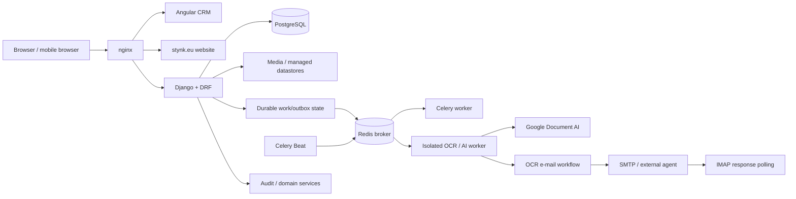

# Stynk CRM — engineering system deep dive

[← Case study overview](STYNK_CRM.md) · [Discovery & evolution](STYNK_DISCOVERY_AND_EVOLUTION.md) · [Product & domain](STYNK_PRODUCT_AND_DOMAIN.md) · [Model & runtime](STYNK_MODEL_AND_RUNTIME.md)

This page covers the system around the product: modular application architecture, durable background work, deployment, operations, repository structure and the verification surfaces that make a fast-changing production system maintainable.

## 3. System architecture

The application is built as one **coherent business core, modular by domain**.

Contracts, Jobs, pricing, payments, planning, notifications and audit share one transactional model, while domain apps and service-layer boundaries keep responsibilities explicit.


The current production shape is roughly:



The core stack is:

- Angular frontend;
- Django + Django REST Framework backend;
- PostgreSQL in production;
- nginx as the public reverse proxy/static server;
- gunicorn for Django;
- Docker Compose for the application stack;
- Celery + Redis for application background work;
- Celery Beat with database-backed schedules;
- local/managed file storage with an extension seam for external datastores.

The backend is split into Django apps aligned with domain responsibilities such as accounts, clients, contracts, Jobs, pricing, payments, attachments, OCR, sales and analytics.

The service layer owns business processes; API views are intended to remain relatively thin.

The useful property of this shape is that multi-step business transitions remain local and transactional while external/slow concerns still leave through explicit seams.

For example, a lifecycle service can validate a transition, update several related models, create payment obligations, emit notifications and record audit state as one coherent workflow rather than reconstructing the same business rule across several independently deployed services.

---

---

## 4. Background work: Celery as execution, Django as truth

One architectural rule I care about in this system is that **the task queue is not the business database**.


Redis is used as a Celery broker, but durable work state lives in Django/PostgreSQL.

The current worker topology separates ordinary background work from heavier or externally dependent OCR/AI work:

```text
normal worker
  ├─ default
  ├─ notifications
  └─ maintenance

isolated worker
  ├─ ocr
  └─ ai

Celery Beat
  └─ database-backed periodic schedules
```

The Celery result backend is intentionally disabled.

For business-significant work, durable Django rows and an outbox-style boundary carry identifiers into the queue **after the database transaction commits**.

That gives the system several useful properties:

- a Redis outage does not erase the knowledge that work still needs to happen;
- Beat/reconciliation can rediscover pending work;
- background jobs do not need to contain contract contents, credentials or other business truth in broker payloads;
- application state can be inspected through normal Django/admin models rather than reconstructed from a queue;
- host-level responsibilities such as backups, certificate renewal and Docker watchdogs remain outside Celery so they still work when the application stack is unhealthy.

Redis persistence and broker failure are still treated as real operational concerns; the architecture simply avoids pretending the broker is the source of record.

---

---

## 11. Deployment and operations

The production deployment deliberately fits on one Linux VPS.

That keeps the operational burden proportional to the company while still using clear service boundaries:

```text
Ubuntu host
  ├─ Docker Compose
  │   ├─ nginx
  │   ├─ Django/gunicorn
  │   ├─ PostgreSQL
  │   ├─ Redis
  │   ├─ Celery worker
  │   ├─ OCR/AI worker
  │   └─ Celery Beat
  │
  ├─ systemd supervision / watchdog
  ├─ cron-managed host operations
  ├─ backups
  └─ host-managed mail stack (separate boundary)
```

The same repository contains the deployment tooling.

The `./stynk.sh` entrypoint handles development, installation, updates, configuration and status flows.

Staging follows the same deployment model but uses isolated Compose resources/ports so it can coexist with production on the same host.

Backups use PostgreSQL's own `pg_dump` inside the DB container and include revision metadata needed to understand which application/site version a restore belongs to.

The CRM and public website are built/deployed together through nginx while remaining separate hostnames and API/security surfaces.

---

---

## 12. Engineering the repository for maintainability

A large part of the work is not visible in screenshots.

The repository is structured so that the codebase itself carries operational and architectural knowledge:

- domain model documentation;
- process/lifecycle specifications;
- API/architecture docs;
- deployment runbooks;
- test-environment instructions;
- release-readiness reports;
- migration/runbook documentation;
- CI workflows;
- deterministic manual E2E modules for critical journeys.

The project is also intentionally optimized for coding-agent participation.

That does not mean "let agents change everything".

The useful pattern has been:

```text
authoritative docs
      +
bounded task context
      +
tests / CI / browser evidence
      +
GitHub issues / PRs
      ↓
agent implementation / review
      ↓
human or automated acceptance evidence
```

The objective is to make repository state and verification carry context instead of relying on one giant prompt or one person's memory.

---
