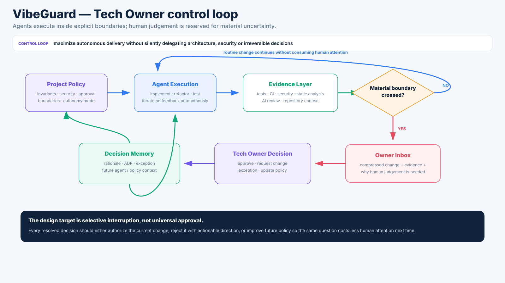
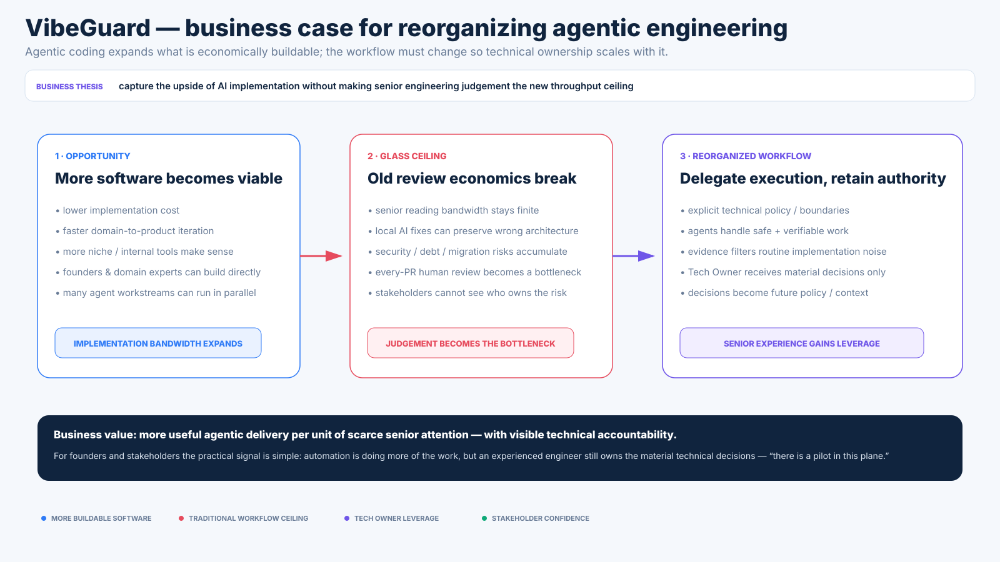
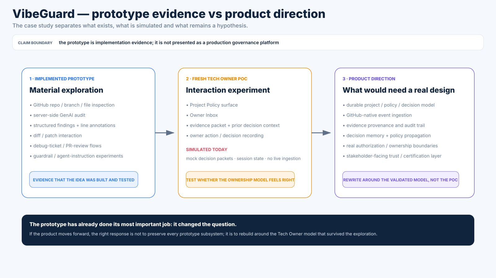

# VibeGuard — scaling agentic software engineering without losing technical ownership

> **Source:** private R&D repository / public sanitized case study  
> **Status:** fresh product-concept PoC built on top of an earlier prototype  
> **Role:** product concept · technical direction · full-stack prototyping · workflow design  
> **Focus:** human technical ownership, AI-assisted delivery, architecture/security sanity, evidence and escalation

VibeGuard started from a simple observation: AI can make software implementation dramatically more accessible, but it does not automatically give the person driving the prompts the engineering judgement needed to understand what the system is becoming.

A vibecoder can get surprisingly far while still being unable to answer questions such as:

- Is the architecture still coherent after six rounds of changing the concept?
- Did the agent actually simplify the system, or just hide another layer of accidental complexity?
- Is this refactor local, or does it invalidate assumptions across the whole codebase?
- Are secrets, auth boundaries and data migrations still sane?
- Is technical debt accumulating faster than the product is maturing?
- Is the model confidently inventing APIs, dependencies or constraints that do not exist?
- Can a founder tell investors, customers or partners that a real engineer is actually accountable for the technical side?

The current hypothesis is therefore broader than "AI code review":

> **AI can own more implementation work without removing human technical ownership.**

Getting an LLM to produce code is rapidly becoming the easy part.

The harder engineering problem is making an AI-heavy system survive **a year of changing requirements, new features, architecture corrections and large refactors** without turning into a pile of locally plausible decisions that nobody fully understands.

And there is a commercial threshold beyond technical correctness:

> **Can we confidently sell this system while knowing who is responsible for what is inside?**

That is the layer VibeGuard is exploring.

Not another model, prompt, skill or plugin, but a different **engineering model**: delegate implementation where evidence makes delegation safe, preserve experienced human judgement where the system itself is being redefined, and leave enough technical evidence that founders and stakeholders do not have to accept a black box on faith.

VibeGuard puts an experienced engineer above the implementation loop as a persistent **Tech Owner**: the person who owns architecture, security boundaries, refactor direction, irreversible choices and technical sanity while agents handle an increasing share of execution.

This is still a hypothesis, not validated market evidence. But it is not a detached forecast either. It comes from a recurring first-principles pattern in my work: go under an abstraction, rebuild enough of the machinery to expose the real constraints, and only then decide which layer actually needs to exist. Older projects such as [JustBuild](https://github.com/SzymonZyrek/just_build_poc), [FetchDog](https://github.com/SzymonZyrek/fetchdog), [Faxus](https://github.com/SzymonZyrek/faxus) and [Meserve](https://github.com/SzymonZyrek/meserve) document the same habit in build systems, artifact resolution and application runtimes.

[Why I trust the direction despite limited evidence →](vibeguard/discovery.md#why-i-take-this-seriously-despite-not-having-market-proof-yet)

## In 30 seconds

| | |
|---|---|
| **Problem** | Vibecoding lowers the cost of producing software faster than it lowers the cost of understanding and owning it. |
| **Initial idea** | Connect vibecoders with senior developers who can inspect, debug and rescue AI-generated code. |
| **Discovery** | The valuable human role is not merely "fix the broken code after the fire"; it is ongoing ownership of the technical decisions that automation should not make alone. |
| **Current PoC** | Project Policy → automated evidence → Owner Inbox → Decision Workspace → recorded owner decision. |
| **Human value** | Sanity, anti-hallucination, architecture, security, technical debt control and confidence for the founder and their stakeholders. |
| **Business case** | Agentic coding can make far more software economically viable, but scaling that implementation safely requires reorganizing work around delegated execution, selective human authority and visible technical accountability. |
| **Prototype boundary** | The current Tech Owner slice is deliberately demo-grade: mock decision packets, local/in-memory state and no claim of production governance infrastructure. |

**Recurring pattern:** let AI carry more implementation bandwidth, but move human attention upward toward decisions whose cost cannot be reduced to "did the tests pass?".


The core product tension is not whether AI can produce useful code. It is whether implementation throughput can increase without silently losing architecture, security, continuity and accountable technical judgement — and whether the resulting system remains something a team can keep changing, refactoring, operating and confidently put in front of paying customers.


---

## The story

### 1. It began as a deliberately vibe-coded prototype

The earliest repository version was essentially an AI Studio export.

That is not something I want to hide in the portfolio; it is part of the point.

VibeGuard was built quickly because the first objective was not to create a production platform. It was to make a rough interaction model tangible enough to argue with.

The first product framing was direct:

```text
vibecoder gets stuck
      ↓
AI triage / audit
      ↓
senior human developer
      ↓
patch / review / resolution
```

The prototype grew a GitHub repository browser, AI-assisted source audit, structured line findings, interactive diffs, debug tickets, PR-review workflows and a marketplace-like surface for experienced human developers.

That version answered one useful question:

> If AI lets far more people build software, can experienced engineers become an on-demand safety layer around that work?

[Discovery & evolution →](vibeguard/discovery.md)

### 2. The prototype exposed a larger problem than debugging

The rescue model is useful, but late.

By the time someone asks a senior to fix one broken file, the codebase may already contain months of local fixes, changing concepts and architectural drift.

The more important failure mode is not always an obvious bug.

It is a system that still appears to work while:

- each new requirement adds another competing abstraction;
- models keep preserving obsolete architecture because it remains in context;
- the same domain concept exists in several forms;
- security boundaries change accidentally;
- infrastructure appears because it solved one prompt locally;
- migrations encode product decisions nobody consciously made;
- token usage increases because agents must reason through unnecessary complexity;
- stakeholders have no credible answer to "who is technically responsible for this?".

That changed the product question.

Not:

> How do we find a human when AI gets stuck?

But:

> **Where should a human remain authoritative while AI keeps moving faster?**


The important result of the prototype is therefore not a fixed feature list. It is the sequence of product assumptions that became too small.

### 3. The human role moved from debugger to Tech Owner

The current PoC reframes the human from an emergency coder into a persistent owner of technical judgement.



The control loop is:

```text
project policy / technical boundaries
              ↓
AI / coding agents implement
              ↓
tests + CI + automated audit
              ↓
can evidence resolve this mechanically?
       ├── yes → continue autonomously
       └── no  → Owner Inbox
                      ↓
               Tech Owner decision
                      ↓
         approve / request change /
         allow exception / update policy
```

The important interface is therefore not another AI chat.

It is an **attention-compression layer** that answers:

1. What materially changed?
2. Why should the owner care?
3. What evidence already exists?
4. Which previous decision or invariant is relevant?
5. What decision is actually being requested?

[Tech Owner model →](vibeguard/ownership-model.md)

### 4. The PoC is intentionally smaller than the idea

The fresh Tech Owner slice has only three main surfaces:

- **Project Policy** — architectural invariants, security boundaries and classes of change that always require human approval;
- **Owner Inbox** — only material escalations, rather than every PR or every model observation;
- **Decision Workspace** — evidence, prior decision context, a diff and an explicit owner action.

The demo includes examples such as:

- an agent introducing Redis and a background worker to change payment execution semantics;
- an OAuth change that crosses an identity/account-ownership boundary;
- a migration that turns a nullable historical field into a mandatory one.

Those packets are deliberately simulated. They exist to test whether the interaction model makes sense before spending time on durable ingestion, persistence or policy propagation.

[Prototype & architecture →](vibeguard/prototype.md)

---

## The product hypothesis

The long-term opportunity is not "certified AI code".

It is a service and workflow around **credible technical ownership** for teams where implementation is increasingly AI-assisted.

A founder or domain expert may be able to drive the product without hiring a conventional engineering team immediately.

But they may still need someone who can say, with professional accountability:

> This architecture is still coherent.  
> This change is acceptable.  
> This is a security problem.  
> This refactor is larger than the agent thinks.  
> This shortcut is fine for now.  
> This one will cost more later than fixing it today.  
> Stop — the model is optimizing the wrong design.

That role can also provide confidence outside the codebase.

The value proposition includes reassurance for:

- the person vibecoding the product;
- co-founders and non-technical stakeholders;
- customers evaluating technical risk;
- investors or partners asking who owns the system;
- future engineers inheriting the project.

VibeGuard is therefore exploring a combination of:

**engineering sanity + anti-hallucination + architecture + security + tech-debt control + accountable human ownership.**

### The business case: push agentic engineering past the old workflow ceiling

The larger opportunity is not only to rescue badly vibe-coded startups.

Agentic coding changes the economics of software creation itself.

If implementation becomes dramatically cheaper and faster, many more real-world problems become worth solving with custom software: internal workflows, niche operational tools, domain-specific products and experiments that previously could not justify a conventional engineering team.

That upside creates a new bottleneck.

Traditional delivery assumes human implementation volume and human review volume grow roughly together. Agentic workflows break that relationship:

```text
implementation capacity grows fast
        ↓
change volume grows fast
        ↓
senior judgement / review capacity stays scarce
```

If every agent-produced change needs conventional senior review, the human becomes the glass ceiling.

If changes are allowed through without meaningful ownership, architecture, security, technical debt and conceptual drift can accumulate faster than stakeholders can see them.

The workflow therefore has to be reorganized around a different split:

```text
delegate what is safe / reversible / verifiable
        ↓
collect machine evidence
        ↓
escalate only material uncertainty
        ↓
experienced Tech Owner keeps authority over the boundary
```

That creates two forms of leverage at once:

1. **agent leverage** — more useful implementation can happen per unit of time;
2. **senior-engineer leverage** — battle-tested judgement is spent on architecture, security, refactor boundaries, debt and irreversible trade-offs instead of repetitive implementation review.

And it creates a third value outside engineering: **credible evidence that somebody real is technically responsible**.

That evidence is what makes the difference between:

> "we vibe-coded something that works and nobody really knows what is inside"

and:

> "we use agentic engineering aggressively, but the system has explicit ownership, decision history, risk boundaries and an experienced engineer accountable for its technical direction."

The second is much easier to sell, integrate, maintain and hand over.

For a founder, customer, investor or partner, the useful signal is not "the AI says the code is fine".

It is closer to:

> **There is a pilot in this plane.**

A real engineer owns the technical direction, material decisions are explicitly reviewed, and there is evidence showing where automation stopped and human judgement took over.



[Business case deep dive →](vibeguard/business-case.md)

---

## A useful distinction: review vs ownership

A reviewer asks:

> Is this change good enough to merge?

A Tech Owner asks:

> Is this still the system we intend to build?

Those are different scopes.

Code review can catch a bad implementation.

Technical ownership should also catch a locally good implementation of the wrong architecture.

That is why the current model introduces concepts such as:

- project policy;
- technical invariants;
- explicit approval boundaries;
- evidence packets;
- owner decisions;
- exceptions;
- decision memory;
- future policy updates.

The human is not meant to approve every action.

The system should reduce human attention over time by making repeatable decisions executable and escalating only material uncertainty.

[Read the ownership model →](vibeguard/ownership-model.md)

---

## Prototype architecture

The existing prototype is a React + TypeScript / Express application with:

- GitHub REST repository/branch/file inspection;
- server-side Google GenAI integration;
- structured AI code-audit output;
- line-level annotations and suggested fixes;
- diff/patch interaction;
- debug-ticket and PR-review flows;
- architecture/guardrail authoring experiments;
- Docker-based development/test/production-style configurations.

The newer Tech Owner control-loop slice deliberately reuses that prototype rather than pretending the UI needed a clean rewrite first.

That makes the relationship clear:

```text
old prototype capabilities
  ├─ repository inspection
  ├─ audit
  ├─ diff/review
  ├─ PR workflow
  └─ guardrails
          ↓
new product question
          ↓
Tech Owner PoC
  ├─ Project Policy
  ├─ Owner Inbox
  └─ Decision Workspace
```

The code is evidence that the idea was explored materially, not proof of a production-ready platform.



[Prototype & source boundary →](vibeguard/prototype.md)

---

## Explore by depth

| If you have… | Read / view |
|---|---|
| **30 seconds** | This page. |
| **3–5 minutes** | [Visual tour](vibeguard/visual-tour.md) — conceptual diagrams for the responsibility gap, discovery path, ownership loop and prototype boundary. |
| **5 minutes** | [Discovery & evolution](vibeguard/discovery.md) — AI Studio prototype → rescue marketplace → review layer → persistent Tech Owner. |
| **5–10 minutes** | [Tech Owner model](vibeguard/ownership-model.md) — what remains human-owned and why. |
| **5–10 minutes** | [Business case](vibeguard/business-case.md) — why agentic engineering may expand the amount of software worth building, where the traditional workflow hits a ceiling, and how senior technical ownership could become leverage. |
| **5–10 minutes** | [Prototype & architecture](vibeguard/prototype.md) — what really exists, what is simulated and what a production rewrite would need. |

---

## Evolution in one line

```text
AI Studio experiment
   → vibecoder ↔ senior rescue marketplace
   → repository audit + diff + PR review
   → guardrails / architecture policy
   → attention-compression problem
   → persistent Tech Owner
   → human-owned decisions above agent execution
```

The important part of the project is not that every step should survive into a future product.

The useful result is the sequence of discarded assumptions.

---

## What I would measure if this became a real product

The most interesting success metric is probably not "number of AI bugs found".

It is closer to:

> **How much useful software can be delivered per unit of senior human attention without losing technical accountability?**

That suggests future metrics around:

- owner interruptions per delivered change;
- repeated escalation classes eliminated through policy;
- architecture/security issues caught before merge;
- time spent reconstructing context;
- rate of accepted vs rejected agent decisions;
- technical-debt trend;
- time required for a new human engineer to understand why the system looks the way it does.

The purpose is not to remove the engineer.

It is to spend engineering judgement where it is actually scarce.

---

## Source and claim boundary

The VibeGuard implementation repository is private while the concept is still evolving.

This case study deliberately separates three things:

1. **Implemented prototype capabilities** — Git/repository inspection, AI audit, structured findings, diff/review interaction, debug/PR flows and supporting prototype infrastructure.
2. **Fresh Tech Owner PoC** — a demo interaction slice using mock decision packets and in-memory/session state.
3. **Product direction** — durable decision memory, policy propagation, real event ingestion, ongoing ownership/certification workflows and stakeholder-facing trust signals.

The portfolio does not present category 2 or 3 as production functionality.

The prototype has already done its most important job: it made the problem concrete enough to change the model.
