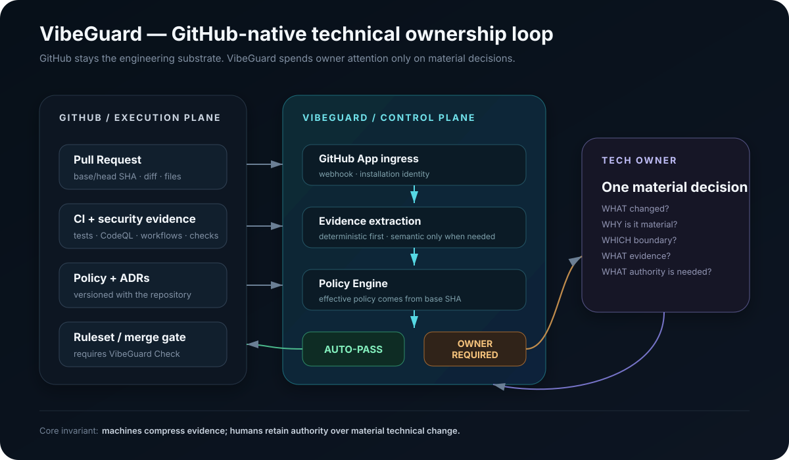
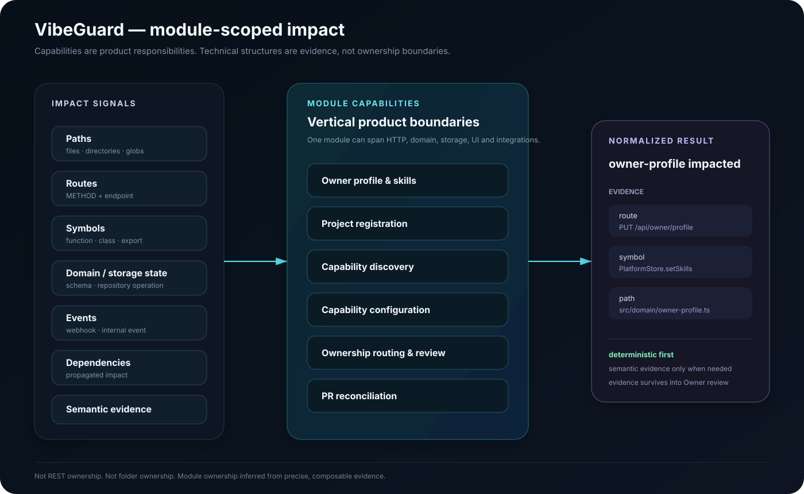

# VibeGuard — technical ownership control plane for AI-heavy software development

> **Source:** private repository / public sanitized case study  
> **Status:** active prototype, real GitHub dogfood  
> **Role:** product concept, architecture, full-stack implementation, trust-boundary design and workflow R&D  
> **Current focus:** capability ownership, PR impact, Owner routing, auditable human decisions

VibeGuard started from a simple concern:

**code generation is becoming cheaper much faster than technical responsibility is becoming cheaper.**

The first prototype explored AI code audit, debugging hand-off and a human-review marketplace. Building that exposed a more structural problem underneath: when implementation becomes increasingly automated, somebody still needs to own the boundaries of a system, understand why a change is material and retain authority over the final decision.

That became the current product.

VibeGuard is now a GitHub-native control plane that connects:

- product capabilities;
- the technical evidence showing which capabilities a pull request impacts;
- Owner skills and capability ownership;
- authenticated human review;
- durable GitHub checks, labels and comments.

It is deliberately **not another coding agent**. The goal is to route scarce human attention and authority to the places where automated implementation still needs accountable technical ownership.

---

## 1. The current product loop

The current dogfood path is real GitHub, not a fake demo persona flow.

~~~text
GitHub sign-in
    ↓
install VibeGuard GitHub App
    ↓
register public/private repository
    ↓
Founder defines or confirms capabilities
    ↓
VibeGuard matches capability requirements to Owner skills
    ↓
real PR changes repository state
    ↓
impact resolution finds affected capabilities
    ↓
capability-specific review requirements
    ↓
authenticated Owner Inbox
    ↓
Approve / Request changes
    ↓
durable GitHub check / label / comment
~~~

The important split is intentional:

**the Founder describes the project; VibeGuard resolves ownership; the authenticated Owner makes the technical decision.**

A repository capability definition contains:

- capability id and description;
- impact rules;
- required skills.

It does **not** contain a human Owner identity.

That keeps project structure separate from staffing and prevents repository configuration from becoming an authority shortcut.

---

## 2. Capability model instead of folder ownership

VibeGuard models ownership around product or system responsibilities, not around arbitrary directory trees.

A capability can be something like:

- Owner profile and skills;
- project registration;
- capability discovery;
- capability configuration;
- ownership routing and review;
- PR reconciliation.

The first production detector is deliberately deterministic: changed file paths are resolved against capability path rules.

The next design step is to let the same capability accumulate more precise impact evidence from module-local technical signals such as routes, symbols, state/storage operations, events and dependencies.

The key idea is:

**technical structures are evidence for impact; they are not automatically ownership boundaries.**

A change to one REST endpoint, for example, should not imply that every REST concern in the repository is impacted. Signals stay scoped to the capability/module they describe.

Semantic/LLM impact is intentionally the last fallback, not the default detector.

---

## 3. Founder onboarding: AI proposes, Founder confirms

Manual capability authoring remains valid, but the current product can also help a Founder bootstrap the model from repository evidence.

The onboarding flow is:

~~~text
bounded repository evidence
    ↓
OpenAI Responses API
    ↓
structured capability suggestions
    ↓
Founder review / edit
    ↓
explicit confirmation
    ↓
deterministic runtime configuration
~~~

The model receives a bounded, read-only repository digest. It receives no GitHub write credential and no authority to activate its own suggestion.

The inferred draft is validated again inside VibeGuard.

Provider errors, quota failures or low-quality suggestions degrade to manual onboarding rather than blocking the product.

This is a recurring design rule in VibeGuard:

**LLMs produce evidence and proposals; they do not silently become policy.**

---

## 4. Owner onboarding: skills from evidence, not a magic profile

Owner matching needs an explicit skill model.

The current profile flow can infer skill suggestions from:

- a CV file;
- repositories available through the Owner's linked GitHub App installations.

The inference path is bounded and server-side.

~~~text
CV / repository evidence
    ↓
structured skill suggestions
    ↓
Owner review / merge / edit
    ↓
explicit Save profile
    ↓
deterministic capability matching
~~~

Only saved skills participate in assignment.

This matters because there is a large difference between:

- “the model thinks this person probably knows TypeScript”, and
- “this Owner has accepted TypeScript as part of the profile VibeGuard may use for routing.”

The first is evidence. The second is platform state.

---

## 5. PR-aware Owner review

The current Owner Inbox is organized around real pull requests rather than disconnected approval tickets.

For an impacted PR, the Owner can see:

- repository and PR context;
- capability being reviewed;
- why that capability was routed to them;
- matched files / impact evidence;
- additions and deletions;
- capability-scoped GitHub patches;
- current decision state.

The primary product flow no longer asks a user to know and type a PR number. VibeGuard discovers open pull requests for registered projects; manual resync exists as a recovery action rather than the normal workflow.

A decision is bound to the exact PR head and capability.

That means a previous approval does not silently survive a new commit.

~~~text
capability + Owner + exact head
          ↓
        decision
          ↓
new commit changes head
          ↓
old decision becomes stale
          ↓
fresh review requirement
~~~

This turns stale-head invalidation from a UI convention into a correctness property.

---

## 6. GitHub is the durable evidence surface

VibeGuard does not try to replace the repository workflow.

GitHub remains the execution substrate for:

- pull requests;
- commits;
- CI;
- checks;
- labels;
- comments;
- repository configuration.

VibeGuard adds a control plane around those primitives.

The current real-GitHub dogfood has exercised private-repository registration, GitHub App installation routing, PR reconciliation, deterministic capability impact, real Owner assignment and GitHub write-back.

A self-hosted Windows runner is also used for real integration/acceptance work so the system is tested against its own repository instead of only against mocks.

That dogfood loop has already exposed product bugs that unit tests alone would not have found, including invalid capability overrides, stale local backend behavior and session-bootstrap failure states.

That is exactly the kind of feedback loop the project is meant to create.

---

## 7. Trust boundaries

The project is built around explicit authority boundaries.

### Human identity

GitHub OAuth identifies the human.

Browser sessions use server-managed cookies. Human OAuth credentials are not reused as repository service credentials.

### Repository access

The GitHub App installation accesses repositories and performs repository-side actions.

Registered projects resolve through the persisted installation rather than a human token.

### Capability policy

The effective capability definition for PR routing is read from the trusted base side of the pull request, so a PR cannot casually rewrite the policy that judges itself.

### LLM boundary

OpenAI is used for bounded capability and skill inference.

The model:

- gets read-only evidence;
- has no GitHub tools;
- gets no repository write credential;
- cannot directly assign an Owner;
- cannot directly activate capability policy;
- cannot approve a review.

### Human decision

Only the authenticated assigned Owner can resolve the matching capability requirement.

No eligible Owner is an explicit unresolved state rather than an automatic pass.

---

## 8. Architecture

The current stack is intentionally small enough to keep the control plane inspectable:

- React 19 + TypeScript;
- Vite;
- Express / TypeScript;
- SQLite via Node 24 node:sqlite;
- GitHub App + GitHub OAuth;
- OpenAI Responses API for bounded onboarding inference;
- Vitest + V8 coverage;
- Playwright E2E;
- Docker / Docker Compose.

A simplified architecture is:

~~~text
                    GitHub
        PRs / App / OAuth / checks
                      │
                      ▼
             GitHub adapters
                      │
                      ▼
         application / domain core
        ┌─────────────┼─────────────┐
        │             │             │
 capability     impact resolver   ownership
 discovery                       + decisions
        │             │             │
        └─────────────┼─────────────┘
                      ▼
                 SQLite state
                      │
                      ▼
              React product shell

OpenAI adapters feed bounded suggestions into onboarding.
They do not sit in the authority path for PR decisions.
~~~

The architecture intentionally separates provider adapters, GitHub adapters, application services and domain types so that “call an LLM” does not leak into the deterministic ownership path.

---

## 9. Verification discipline

Because the product itself is about trust, its verification story cannot be decorative.

The repository currently uses:

- unit/domain/application tests;
- mocked GitHub boundaries;
- Playwright product-flow tests;
- real GitHub dogfood fixtures;
- explicit negative-path testing;
- coverage gates;
- production builds in CI.

During the current hardening pass the unit coverage gate was raised to 95%. Browser/E2E coverage is being ratcheted in the same direction rather than treated as a separate “nice to have”.

The most valuable tests are behavioural invariants:

- Founder cannot name an Owner in capability config;
- one PR may impact multiple capabilities;
- each capability requirement resolves independently;
- no Owner fails closed;
- stale head invalidates old decisions;
- wrong user cannot resolve another Owner's requirement;
- duplicate reconciliation is idempotent;
- model suggestions remain inert until human confirmation.

Those are product semantics, not merely implementation details.

---

## 10. The pivot from the first prototype

The first VibeGuard prototype was centered on:

- AI file audit;
- line-level findings;
- debug tickets;
- human patch/diff review;
- a reviewer marketplace concept.

That prototype was useful because it made the original trust problem concrete.

It also exposed that “escalate to a human” is too vague.

A system still needs to know:

- which part of the product changed;
- who actually owns that responsibility;
- why this person is qualified to decide;
- what evidence should be shown;
- how the decision is bound to the exact change;
- where the decision should persist.

The current control-plane architecture is the answer that emerged from that experiment.

So the earlier prototype is not hidden or rewritten out of the story. It is the product-discovery path that led to the current model.

---

## 11. What is still deliberately unfinished

VibeGuard is an active prototype, not a claim of production maturity.

Current open questions include:

- richer impact signals beyond file paths;
- workload/reputation-aware ownership without losing determinism;
- better capability/skill evaluation datasets;
- multi-organization and team policy;
- stronger operator/deployment packaging;
- long-term audit/history UX;
- pricing and commercial packaging;
- how far automatic evidence compression can go before it damages trust.

The marketplace/reputation/payment ideas from the early prototype are not part of the current core.

The current bet is narrower:

**first make technical ownership and review routing correct, explainable and useful inside a real GitHub workflow.**

---

## 12. Why this project matters to my portfolio

VibeGuard connects several things I have spent years doing separately:

- production debugging;
- architecture and ownership boundaries;
- GitHub / CI workflows;
- full-stack product implementation;
- authentication and trust boundaries;
- code review;
- AI-assisted software delivery;
- evaluation and dogfooding;
- human-in-the-loop system design.

The portfolio claim is not “I wrapped an LLM around GitHub”.

It is closer to this:

> As implementation becomes increasingly automated, technical ownership becomes a control-plane problem: detect what changed, preserve evidence, route the right human, bind their authority to the exact change and keep the result auditable.

VibeGuard is the working experiment behind that claim.
