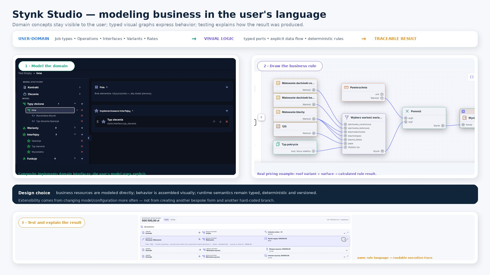
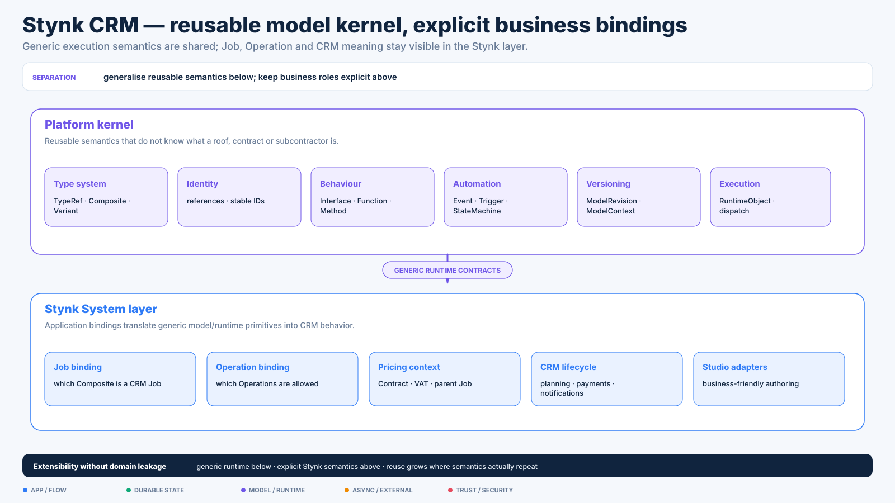
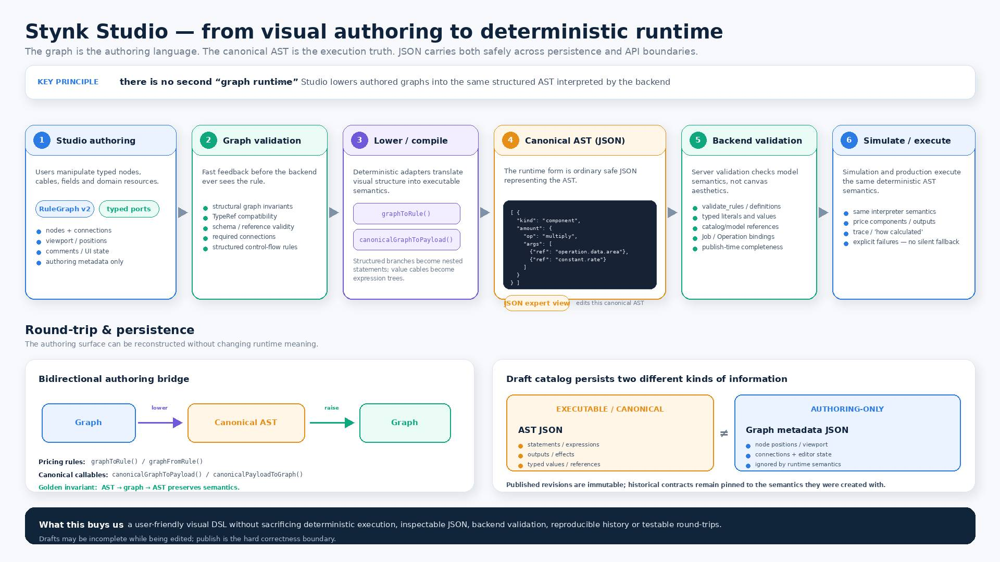
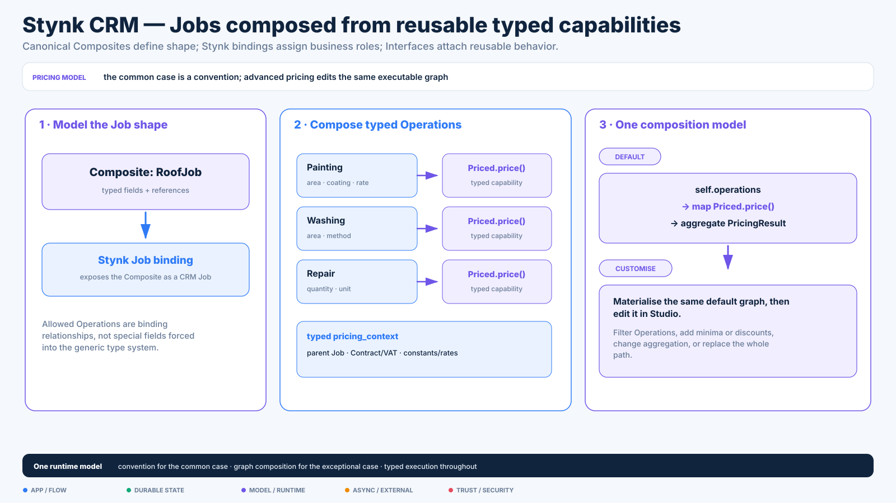
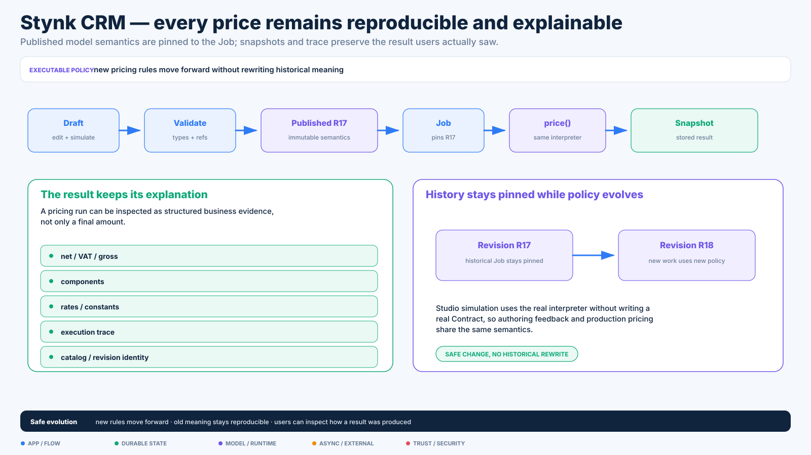

# Stynk CRM — model, Studio & runtime deep dive

[← Case study overview](../STYNK_CRM.md) · [Discovery & evolution](discovery.md) · [Product & domain](product-domain.md) · [Engineering system](engineering-system.md)

This page focuses on the point where changing the business offer stopped being primarily a code-change problem and became a modelling/runtime problem.



The important boundary is intentional: reusable modelling/runtime semantics belong to the generic Platform layer; construction-specific meaning remains explicit in Stynk System bindings.

## 8. Config Studio and the move away from hard-coded pricing

The biggest architectural evolution in the system is the move from hard-coded Job/pricing types toward a configurable model.



The visual authoring surface is intentionally not a second execution engine:



The long-term direction is not to build "a pricing form builder".

It is to let the system describe more of its own business model using:

- typed resources;
- canonical composite types;
- fields and TypeRefs;
- interfaces/methods;
- Job / Operation application bindings;
- callable graphs;
- constants/rates;
- versioned/published catalogs.

A Job can expose Operations as first-class CRM rows while pricing executes through a pinned model/catalog context.

Published catalogs are treated as historical evidence: they are immutable rather than silently reinterpreted after configuration changes.



The pricing path itself is built from typed capabilities: bound Operations can implement `Priced.price()`, receive an explicit typed pricing context and feed the Job's default aggregation convention. Custom pricing materializes that same convention into the normal graph runtime instead of switching to a second hidden engine.



The 3.0.1 binding direction intentionally separates:

```text
generic model language
        ↓
Stynk application binding
        ↓
CRM Job / Operation runtime
        ↓
pricing policy
```

instead of making "Job" and "Operation" fundamental concepts of the generic type system.

The Studio UI is correspondingly more like a small modelling environment than a conventional settings screen: explorer, editor, inspector, diagnostics/dock, model resources and graph-based callable authoring share one workspace.

This is also where the codebase is being generalized into a reusable technical skeleton without forcing Stynk-specific semantics into the generic layer.

---

---

## 9. Event / automation architecture under the Studio layer

The generalized platform work goes beyond pricing.

The current architecture defines typed:

- Events;
- Triggers;
- StateMachines;
- callable effects;
- scheduled and incoming-mail trigger sources;
- semantic `object.changed` triggers.

Some design choices I consider important:

- synchronous Event chains execute inside one atomic transaction;
- external/background delivery happens only after commit where appropriate;
- state-machine instances are pinned to a model revision;
- triggers use durable idempotency receipts;
- event chains carry correlation/causation identifiers;
- dispatch depth is bounded to prevent automation loops;
- semantic object changes go through an explicit mutation boundary rather than broad Django `post_save` magic.

This is active platform/generalisation work rather than a claim that every historical CRM workflow has already been rewritten onto that runtime.

---
