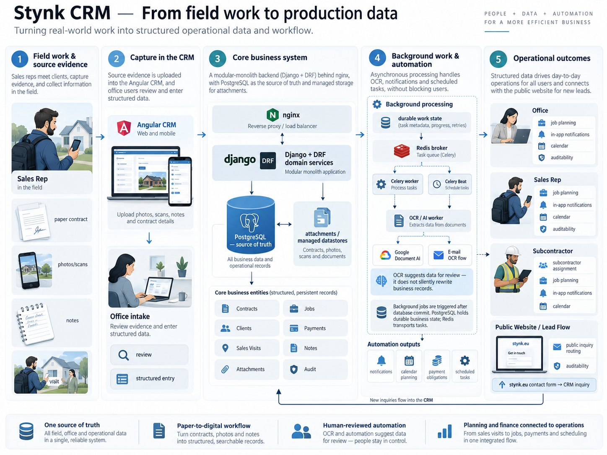
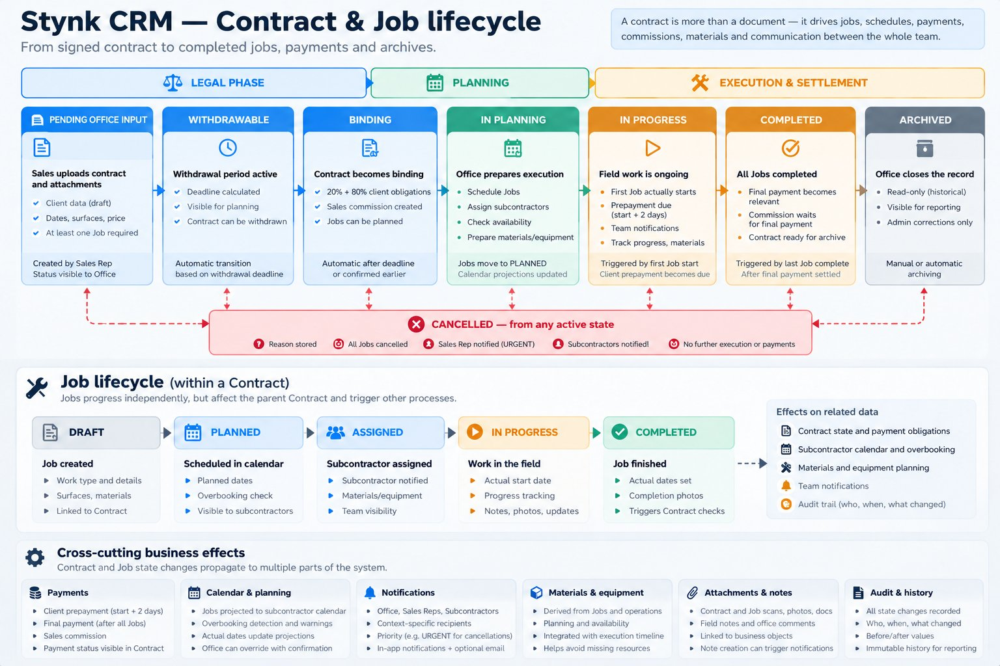
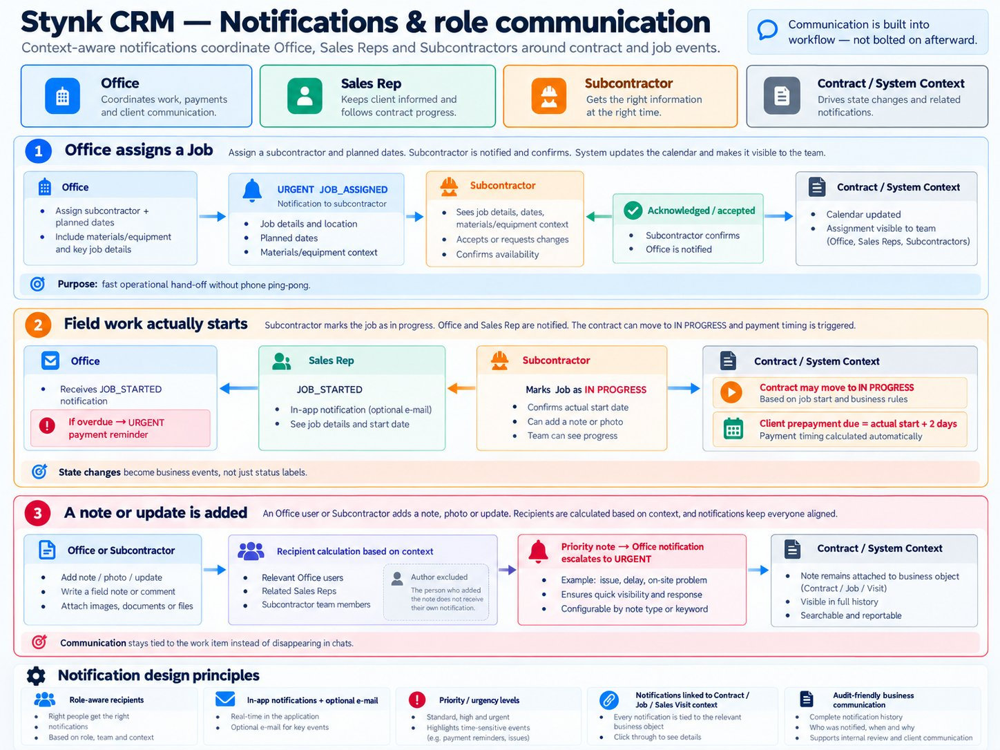
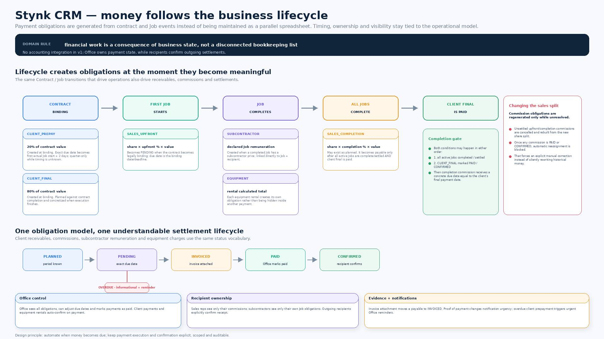
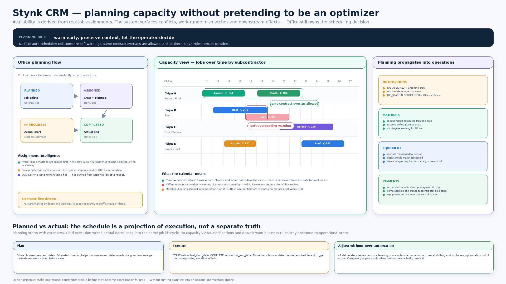
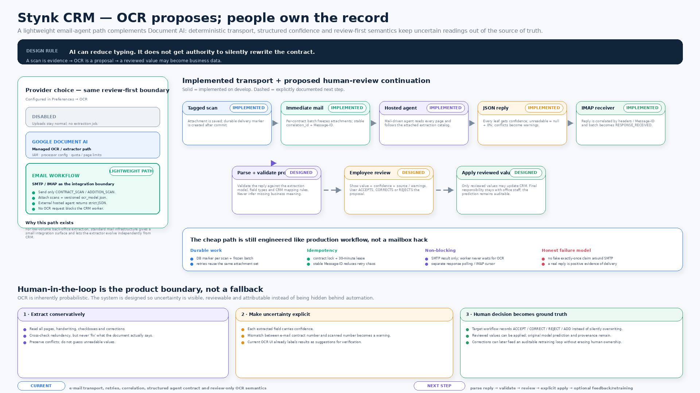
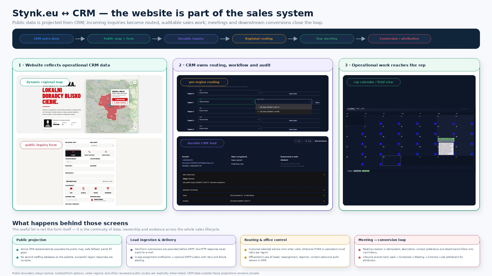
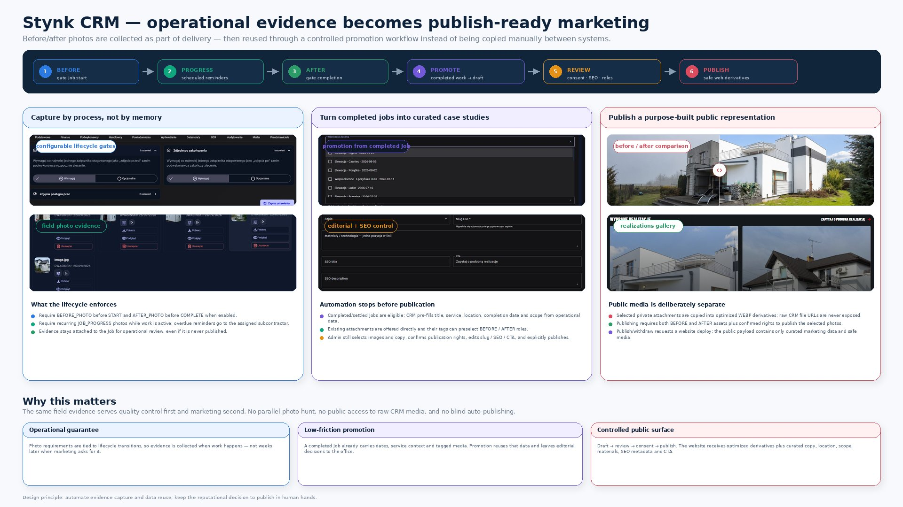
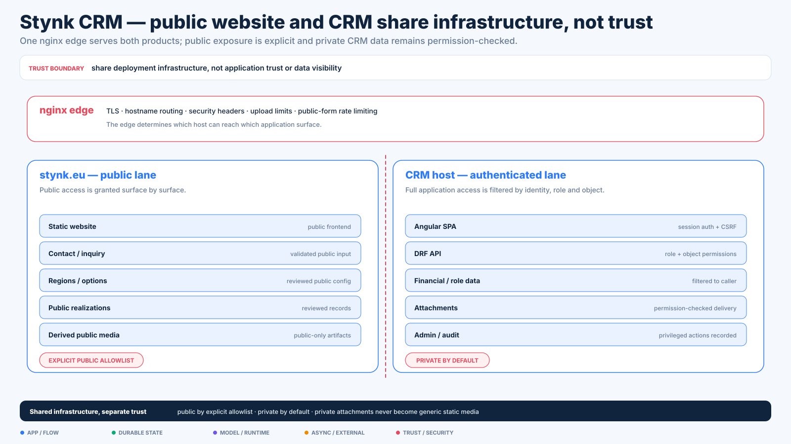

# Stynk CRM — product & domain deep dive

[← Case study overview](../STYNK_CRM.md) · [Discovery & evolution](discovery.md) · [Model & runtime](model-runtime.md) · [Engineering system](engineering-system.md)

This page follows the operational system itself: field evidence → CRM state → lifecycle effects → planning, finance, communication and public/sales workflows.



The key product idea is continuity: the same business object should remain understandable from the first field interaction through execution, payment, audit and public-facing outcomes.

## The problem

Before the CRM, operational information was spread between paper contracts, local spreadsheets, Google Drive, e-mail, WhatsApp and verbal hand-offs.

That is manageable while the organization is small, but it creates recurring failure modes as work volume grows:

- the same information exists in several places;
- updates do not propagate reliably;
- office, sales and field teams see different versions of the same job;
- contract details have to be retyped from paper;
- deadlines and commissions depend on people remembering the process;
- technical photos and notes are detached from the work they describe;
- planning depends too much on individual memory;
- historical reconstruction becomes difficult when something goes wrong.

The goal was therefore not "build a client database".

The goal was to turn a real operating process into one explicit, auditable system while keeping it simple enough that one technical owner can maintain it.

---

## Business workflow modelled by the system

A simplified contract flow looks like this:

```text
field sales visit
      ↓
paper contract signed on site
      ↓
sales rep uploads scans / photos / notes
      ↓
office intake and structured data entry
      ↓
withdrawal period
      ↓
contract becomes legally binding
      ↓
payments / sales commission obligations
      ↓
job planning + subcontractor assignment
      ↓
calendar / resource coordination
      ↓
field execution
      ↓
client payments + final commissions
      ↓
completion / settlement / archive
```

The CRM models this as actual lifecycle state rather than a collection of unrelated forms.



Architecture companion: [lifecycle orchestration diagram](../assets/stynk/diagrams/02-lifecycle-orchestration.svg)

For example:

- a contract uploaded by Sales starts in office intake;
- once required structured data and at least one Job exist, it can move into the withdrawal/legal phase;
- after the withdrawal deadline the contract can become binding automatically;
- binding creates payment/commission obligations;
- assigning and scheduling Jobs drives planning;
- the first actual Job start moves execution forward and activates the client prepayment due date;
- finishing the last Job moves the contract toward completion;
- the final sales commission becomes payable only when the required job-completion and client-payment conditions are both satisfied;
- cancellation propagates into Jobs and remains visible in audit history.

This is the kind of domain logic that made the project much more interesting than CRUD.

---

## Communication, finance and planning as lifecycle projections







These are deliberately not separate mini-systems. Notifications, payment obligations, commissions and planning are projections of the same Contract/Job lifecycle and role model.

## OCR: two providers, one review-first contract

Contract intake is one of the clearest examples of the system trying to remove repetitive office work without giving automation too much authority.

Only contract/annex scan attachments are eligible for OCR.

The system supports two provider modes.

### Google Document AI

The direct provider path can use Google Document AI.

Important boundaries:

- OCR is disabled by default;
- provider/project/processor settings are admin-controlled;
- credentials can come from deployment secrets or an admin-managed encrypted credential record;
- credentials are never returned through the normal API or placed in generic Preferences;
- monthly page budget can be reserved before provider execution;
- transient provider errors can be retried;
- output is stored as reviewable text/suggestions;
- OCR **does not silently rewrite Contract, Client, financial, commission or Job data**.

The extraction model is versioned and explicitly defines expected fields/types and confidence.

The contract is therefore:

```text
scan
  ↓
extract
  ↓
normalize / confidence
  ↓
human review
  ↓
explicit application
```

—not "AI saw a number, therefore the database now contains it".

### E-mail OCR workflow

The alternative e-mail provider is one of my favourite integrations in the project because it treats unreliable external communication as a workflow instead of a single API call.

When an eligible scan is committed:

1. the database gets a durable per-attachment delivery marker;
2. only **after commit** is an OCR task enqueued;
3. the worker locks the logical Contract and freezes pending scans into one durable batch;
4. the batch receives a correlation ID and deterministic `Message-ID`;
5. one message is sent with subject `OCR: #<contract-number>`, the relevant scans and the extraction model;
6. SMTP acceptance changes the batch state to `SENT`;
7. the worker finishes — it does **not** sit around waiting for OCR.

A separate recovery worker periodically repairs stale/pending delivery state and re-enqueues work when necessary.

A third worker polls the configured mailbox over IMAP. It keeps a durable UID cursor and correlates replies primarily through `In-Reply-To` / `References` against the deterministic message ID.

This makes the asynchronous chain roughly:

```text
upload transaction
       ↓ commit
durable attachment delivery
       ↓
immediate Celery send
       ↓
durable OCR batch
       ↓
SMTP message
       ↓
external OCR agent
       ↓
reply e-mail
       ↓
IMAP cursor / correlation
       ↓
RESPONSE_RECEIVED
       ↓
future parse / validate / review
```



The workflow is deliberately honest about the SMTP crash window: SMTP cannot provide strict distributed exactly-once semantics across "remote server accepted mail" and "local database committed sent_at".

Instead of hiding that, the design uses:

- stable batch identity;
- stable `Message-ID`;
- DB locking/leases;
- idempotent response processing;
- positive evidence from an actual OCR reply.

Transport and interpretation of the OCR result are separate concerns.

That separation is particularly important because a successful message delivery is not the same thing as a trustworthy business-data update.

---

## Frontend: responsive workflow UI, not a shrunk desktop

The frontend is Angular with a shared component layer and theme-aware SCSS.

The UI direction is deliberately restrained: dark/day themes, whitespace-based separation, consistent typography, small interaction feedback and reusable layout primitives rather than feature screens inventing their own visual system.

Shared primitives include, among others:

- `PanelShell` for top-level surfaces;
- `SectionHeader`;
- `ActionBar`;
- responsive `FormGrid`;
- `MetaTable` and simpler table primitives;
- reusable form field/input components;
- address/contact/identity panels;
- map-assisted address input;
- attachment gallery;
- shared note/comment cards;
- shared lock/edit patterns.

### Phone portrait mode

One important UX lesson was that "responsive" does not mean taking a desktop composition and continuously making it narrower.

For phone portrait, the application has dedicated presentation behaviour.

The shared shell supports `phonePortraitFlat` and `phonePortraitBleed`, and the current code uses that pattern in screens including:

- contract editor;
- Job detail;
- client editor;
- user management;
- subcontractor calendar;
- payment detail.

There is also explicit `max-width: 480px` handling across shared and feature styles.

The phone-oriented design flattens nested panel/card chrome, gives actual content more width, stacks label/value pairs, changes dense tables into card-like presentations where appropriate, makes attachment/note actions touch-friendly and avoids horizontal scrolling.

This matters because Sales and subcontractor workflows are naturally used away from an office desk.

---

## Selected product features

The full system contains many small workflows; these are the ones I think best illustrate its character.

### Contract intake and office hand-off

Sales representatives can upload paper-contract scans/photos plus attachments and notes.

Office receives the pending Contract, reviews the scanned source and enters/validates structured data.

The workflow intentionally retains the original evidence next to the normalized business record.

OCR can assist this process, but it remains review-first.

### Job lifecycle and pricing

A Contract contains one or more Jobs.

Jobs have their own lifecycle and can be:

- planned;
- assigned to subcontractors;
- started;
- completed;
- cancelled/settled according to workflow.

The system connects operational state to financial and planning consequences rather than making users reproduce those links manually.

### Scheduling and overbooking

The planning calendar is derived from Job data rather than maintaining a second calendar database.

Office can assign subcontractors and planned dates; the system can detect date overlap between different Contracts and surface an overbooking warning while still allowing an explicit override.

The calendar supports global/subcontractor-oriented planning and uses lifecycle state to communicate work status.

### Mobile-first field sales visits

The Sales Visit module uses a reusable:

```text
city → street → building number → visit history
```

hierarchy optimized for repeated field work.

It supports:

- repeated visits to one address;
- notes/photos;
- ownership and role permissions;
- edit locks;
- visit type/contact channel/result status;
- month/week/day calendar views;
- status-colored visit bars;
- map view for on-site meetings;
- location/map-assisted address entry;
- linking an existing Client or creating a partial Client from a meeting flow;
- completion flow with an optional quick note.

This is a good example of domain-specific UX that would be awkward to force into a generic "activities" table.

### Public website → CRM lead flow



The public `stynk.eu` contact form is not just an e-mail form.

A valid request is first persisted as a durable CRM `PublicInquiry`.

The workflow includes:

- server-side validation;
- honeypot handling;
- optional images;
- postal-region lookup;
- preferred adviser validation;
- fallback assignment/round-robin within a region;
- in-app notification;
- durable mail delivery state;
- asynchronous SMTP after commit;
- retry handling;
- lead reassignment/decline;
- audited conversion into a Client;
- idempotent meeting creation.

The HTTP response does not wait for SMTP.

That means an SMTP outage does not turn a valid lead into lost browser state.

### Operational media → public realizations



Operational media can be promoted into reviewed public-facing realizations without giving the public website access to the private CRM media surface.

### Audit history

Business audit is separate from technical logging.

For enabled entity/action families, the system records:

- who changed something;
- when;
- entity type and identity;
- before/after data;
- action type.

Some UI audit timelines expand one logical object into related records, so the system can reconstruct meaningful history even when a related entity was later deleted.

Raw audit tooling is admin-only.

### Managed file storage

Attachments started on local media storage, but the current storage layer introduces a managed datastore seam.

A managed file permanently records which physical datastore/provider locator owns it.

New writes can select the current preferred datastore, while reads continue to resolve through the stored location rather than assuming that "today's preferred datastore" also contains yesterday's files.

The current implementation supports local storage and Google Drive with encrypted OAuth refresh credentials; the same interface leaves room for an S3-compatible backend later without changing Contract/Attachment business models.

---

## Permissions, edit ownership and operational safety

The application has four primary business roles:

- Admin;
- Office;
- Sales Rep;
- Subcontractor.

Permissions are enforced both at route/API level and through object-level filtering.

Several complex edit surfaces use an explicit lock/padlock pattern so two users do not casually overwrite each other's work.

This is especially useful on long forms where "last HTTP request wins" would be a poor concurrency model.

Security/operational boundaries also show up in deployment:



- the public website exposes only an allowlisted subset of CRM APIs;
- private CRM attachments are not exposed through public-site media paths;
- credentials are kept out of browser-visible configuration;
- deployment/install flows run security checks;
- the mail server remains a separate service boundary from the Docker web stack.

---
