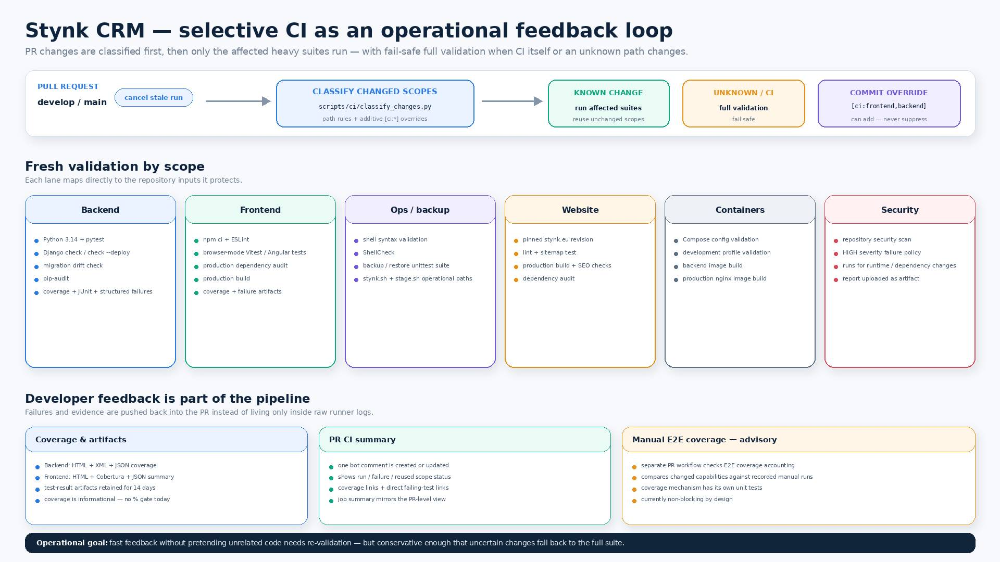
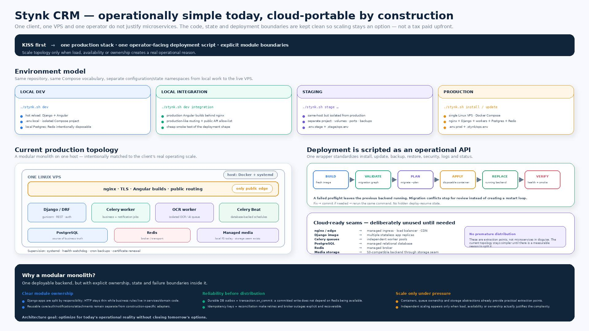
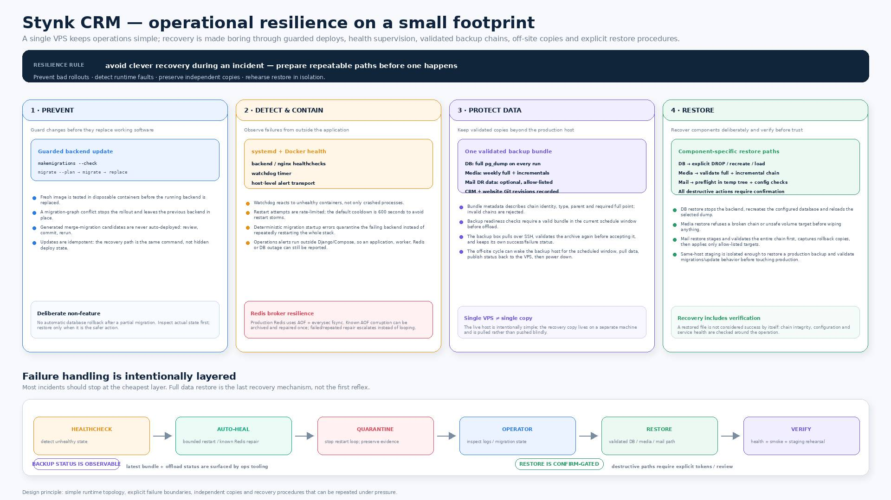
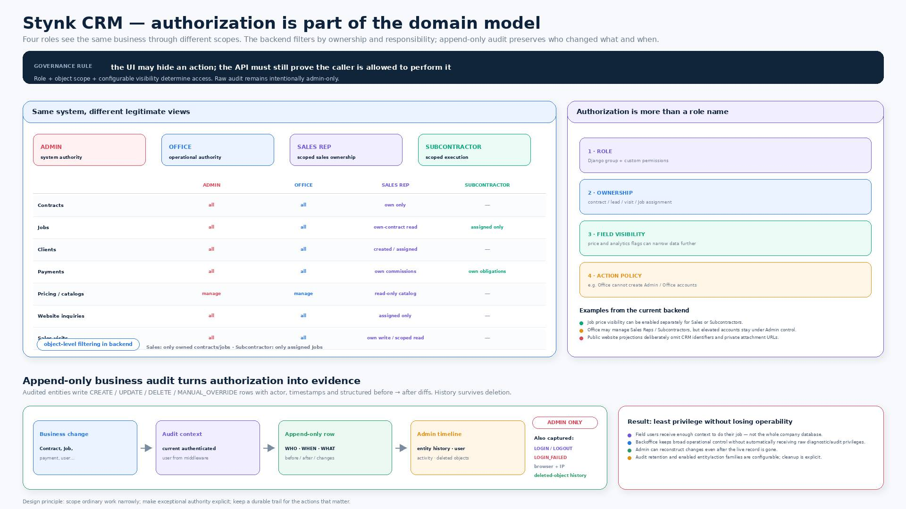
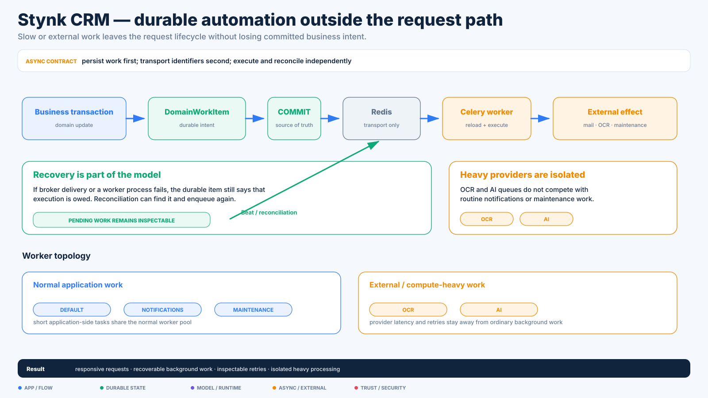

# Stynk CRM — visual tour

[← Case study overview](../STYNK_CRM.md) · [Discovery](discovery.md) · [Product & domain](product-domain.md) · [Model & runtime](model-runtime.md) · [Engineering system](engineering-system.md) · [Visual tour](visual-tour.md)

This is the shortest visual path through the project. The JPEG slides combine real/sanitized product screenshots with the system story; the SVG diagrams isolate architectural mechanisms.

## Product & domain

### From field work to production data

### Contract & Job lifecycle

### Notifications & role communication

### Financial lifecycle

### Planning, capacity & field execution

### Website ↔ CRM sales loop

### Operational photos → public realizations

### OCR with human review

[Read the product/domain deep dive →](product-domain.md)

---

## Model & runtime

### Model business concepts directly

### One authoring language, one deterministic runtime

### Architecture companions

[Read the model/runtime deep dive →](model-runtime.md)

---

## Engineering system

### Quality gates from domain rules to a real browser

### Selective CI as a feedback loop

### Deployment sized to the operating model, portable by construction

### Operational resilience & recovery

### Permissions, audit & governance

### Architecture companions

[Read the engineering-system deep dive →](engineering-system.md)

---

## How it got here

The visual set shows the current system. The discovery deep dive shows why those concepts exist at all: the sequence from contract capture to workflow, lifecycle, configurable Jobs/pricing, canonical runtime and Studio.

[Read discovery & evolution →](discovery.md)
