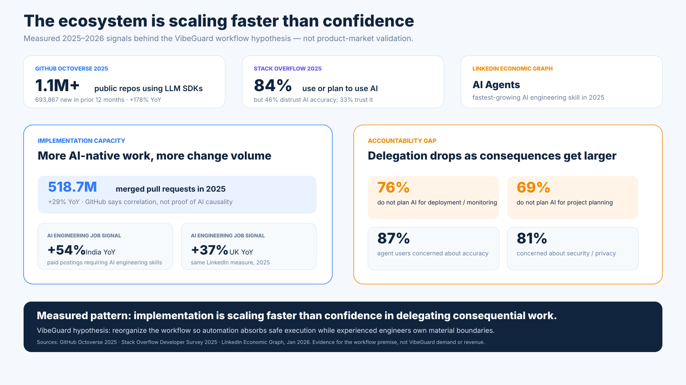

# VibeGuard — business case: scaling agentic engineering without scaling chaos

[← Case study overview](../VIBEGUARD.md) · [Evidence](evidence.md) · [Discovery](discovery.md) · [Tech Owner model](ownership-model.md) · [Prototype & architecture](prototype.md) · [Visual tour](visual-tour.md)

VibeGuard is partly a product idea and partly a bet on where software engineering is moving.

The bet is not that coding models will become useful.

They already are.

The important question is what happens **after coding itself stops being the scarce capability**.

The opportunity created by agentic coding is much larger than "developers type code faster".

The deeper opportunity is that software can be applied to far more real-world problems because the cost of turning domain intent into working implementation is falling.

That potentially changes which projects are economically worth building.

A founder, operations expert, small business, internal team or domain specialist can now attempt software that previously required a larger engineering organization just to get started.

That is the upside.

The corresponding problem is that **implementation capacity can scale much faster than technical judgement, continuity and accountability**.

A workflow that looks impressive during a two-week prototype can still hit a hard ceiling after twelve months of:

- changing business concepts;
- overlapping generations of architecture;
- migrations;
- integrations;
- security boundaries;
- accumulated exceptions;
- refactors whose real scope is larger than the current prompt context.

VibeGuard is exploring whether implementation and ownership can be separated cleanly enough to capture the upside without inheriting those failure modes.

## Evidence before the pitch

The external research supports the **premise**, not the revenue model.

GitHub, Stack Overflow and LinkedIn data point in the same direction: AI-assisted implementation is normalizing quickly, while trust, security concerns and willingness to delegate consequential work lag behind.

That is enough to justify testing a new workflow layer. It is not evidence that customers will pay for VibeGuard.

[Exact sources, numbers and claim boundaries →](evidence.md)

---

## 1. Agentic engineering expands the addressable problem space

Traditional software development has several expensive constraints:

- experienced implementation capacity is scarce;
- context transfer is slow;
- many domain-specific tools are too small to justify a conventional team;
- iteration across product, domain and engineering can be expensive;
- senior engineers spend substantial time on work below their highest-leverage decision level.

Agentic coding changes some of those economics.

If agents can reliably perform more bounded implementation work, then teams can attempt:

- more product experiments;
- more internal automation;
- more custom software around niche operational problems;
- more domain-specific tooling;
- more rapid integration of software into traditionally non-software-heavy businesses.

That is the exciting part.

The business opportunity is not merely "sell AI coding".

It is to **make much more software economically viable**.

---

## 2. But traditional engineering workflow creates a glass ceiling

The old workflow assumes something close to:

~~~text
human understands requirement
        ↓
human writes most code
        ↓
human reviewer reads diff
        ↓
human team collectively carries architecture context
        ↓
human release / operation
~~~

Agentic coding breaks the first assumption much faster than the others.

Now the flow can become:

~~~text
human intent
      ↓
many agent implementation actions
      ↓
huge change volume
      ↓
same senior-review bandwidth as before
~~~

That creates a ceiling.

If every agent-produced change must be reviewed with the same depth as human-written code, senior review throughput becomes the bottleneck.

If it is *not* reviewed, architecture, security, technical debt and conceptual drift can accumulate invisibly.

So simply inserting agents into the old process is not enough.

The workflow itself has to change.

---

## 3. The reorganization: delegate execution, retain authority

The VibeGuard thesis is that the scalable unit is not "AI writes, human approves".

It is:

~~~text
explicit technical policy
        ↓
delegate safe / reversible / verifiable work
        ↓
automated evidence
        ↓
escalate only material uncertainty
        ↓
experienced engineer owns the decision boundary
~~~

This is a different allocation of scarce human capability.

Agents are good candidates for:

- bounded implementation;
- repetitive integration;
- local refactors;
- test generation;
- CI iteration;
- repository search and context gathering;
- mechanically verifiable fixes.

Experienced engineers remain highest-leverage on:

- architecture;
- security/trust boundaries;
- irreversible changes;
- product/technical trade-offs;
- deciding when a local fix is actually a system-level refactor;
- determining which technical debt is intentional;
- deciding when the model is confidently solving the wrong problem.

The commercial hypothesis is that **experienced engineering judgement can supervise substantially more implementation than the same engineer could personally produce or review line by line**.

That is where the leverage appears.

---

## 4. "There is a pilot in this plane"

Agentic workflows also create a trust problem outside engineering.

Stakeholders may reasonably ask:

- Who is actually responsible for this system?
- Has anybody experienced looked at the architecture?
- Are security and data risks being actively owned?
- Is the product maintainable or just still running?
- If the AI gets something wrong, who notices?
- Is there a record of why major technical decisions were made?

A useful service should provide something stronger than:

> the model says the code is fine.

The confidence layer is closer to:

> **A real, accountable engineer owns the technical direction, material decisions are reviewed, and there is evidence showing where automation stopped and human judgement took over.**

In plain language:

> **there is a pilot in this plane.**

That matters to the vibecoder.

It can also matter to co-founders, customers, investors, partners, auditors and future engineers inheriting the system.

VibeGuard therefore treats **stakeholder-facing technical evidence** as part of the value proposition, not an afterthought.

---

## 5. Battle-tested engineers become leverage, not throughput

A traditional scaling response to more software demand is:

> hire more engineers.

Agentic engineering creates another possibility:

> let a smaller number of experienced engineers own more systems by moving them away from repetitive implementation review and toward explicit decision boundaries.

That is not about removing engineers.

It is about capitalising their scarce experience more efficiently.

A strong Tech Owner brings pattern recognition accumulated across:

- failed migrations;
- incidents;
- architecture rewrites;
- production debugging;
- security mistakes;
- integration failures;
- scaling problems;
- operational trade-offs;
- maintainability disasters that looked harmless six months earlier.

Those skills are difficult to encode completely in static rules.

But they can still be **amplified** by a system that:

1. filters routine work;
2. preserves relevant context;
3. packages evidence;
4. remembers previous decisions;
5. routes only the high-value judgement back to the engineer.

That is a much more interesting use of senior talent than turning them into a PR-reading queue.

---

## 6. Evidence is part of the product

For agentic engineering to scale beyond experimentation, trust needs to become material.

The system should be able to show:

- what agents changed;
- what was verified automatically;
- what policy applied;
- which changes were escalated;
- why the human was needed;
- what decision was made;
- what risk was consciously accepted;
- how that decision changes future agent behaviour.

This produces a useful distinction:

~~~text
"AI-assisted development"
          vs
"AI-assisted development with visible technical ownership"
~~~

The second is much easier to defend to stakeholders.

It also creates a potential basis for future:

- project health reporting;
- technical-risk summaries;
- owner attestations;
- architecture/security review evidence;
- transition packages for incoming engineering teams.

The current PoC does **not** implement those as production features.

They are part of the business direction being explored.

---

## 7. The upside is larger than vibecoding startups

The first obvious customer shape is a non-technical or lightly technical founder building with AI.

But the underlying workflow applies more broadly.

The same problem exists anywhere implementation throughput grows faster than senior judgement capacity:

- startups using coding agents aggressively;
- agencies delivering many AI-assisted projects;
- internal enterprise teams adopting agentic workflows;
- domain-heavy SMEs building custom software;
- engineering organizations running multiple coding agents in parallel;
- legacy-modernization work where local AI changes can accidentally preserve the wrong historical architecture.

The common pattern is:

> **more implementation becomes possible than the current human review structure can safely absorb.**

That is the workflow problem VibeGuard is aimed at.

---

## 8. The real product threshold: can we sell it without being afraid of what is inside?

A working demo is not the same thing as a sellable system.

At some point a founder has to make claims to customers, investors, partners or an acquiring engineering team.

Questions become concrete:

- Who understands the architecture?
- Who can explain why this dependency exists?
- Who knows whether the security model is intentional?
- Who can judge whether the next feature requires a local patch or a structural refactor?
- Who knows which shortcuts were deliberate?
- Who can say whether the system will still be evolvable after another year of product change?

If the answer is effectively:

> "the agents built it and it seems to work"

then agentic coding has created implementation without enough technical confidence to support the business around it.

VibeGuard's stronger commercial hypothesis is therefore not merely **quality assurance**.

It is **engineering assurance**: a combination of explicit ownership, evidence and continuity that lets a business use aggressive automation without treating its own software as an opaque asset.

This is where "there is a pilot in this plane" becomes material rather than rhetorical.

The pilot has:

- authority;
- context;
- evidence;
- decision history;
- explicit risk ownership;
- a mechanism for forcing the right refactor when local patches stop being rational.

---

## 9. Pushing past stale boundaries of traditional development

Some assumptions of traditional software delivery were shaped by a world in which human implementation capacity was the dominant bottleneck.

For example:

- one engineer usually produces one stream of implementation at a time;
- reviewing every meaningful code change is feasible;
- architecture context is carried socially across a relatively small team;
- senior engineers are both decision-makers and major implementation throughput;
- adding delivery capacity usually means adding people.

Agentic engineering weakens those assumptions.

That means simply applying AI inside the old org chart may capture only part of the value.

The larger opportunity is to redesign the workflow around:

- explicit context;
- explicit policy;
- machine-readable evidence;
- bounded autonomy;
- selective escalation;
- persistent decision memory;
- human authority at material boundaries.

VibeGuard is one possible control layer for that reorganized workflow.

---

## 10. A possible business flywheel

The product hypothesis can be expressed as a reinforcing loop:

~~~text
agents make implementation cheaper
          ↓
more software projects become viable
          ↓
implementation volume rises
          ↓
technical ownership becomes the scarce resource
          ↓
VibeGuard compresses evidence + routes decisions
          ↓
experienced engineers can own more implementation
          ↓
stakeholders gain confidence in AI-heavy delivery
          ↓
teams delegate more safely
          └──────────────→ more useful agentic engineering
~~~

The product is valuable only if it improves this loop without turning the human into a new bottleneck.

---

## 11. Potential commercial shapes

These are hypotheses, not validated revenue models.

### Continuous Tech Owner

A recurring relationship where an experienced engineer owns technical policy, receives escalations and performs periodic system-health reviews.

### Tech Owner on demand

For smaller projects: establish policy, review high-risk decisions and provide scheduled architecture/security sanity checks.

### Engineering assurance layer

Evidence-oriented reporting for stakeholders:

- architecture health;
- security-sensitive changes;
- unresolved technical risks;
- accepted exceptions;
- major owner decisions.

### Agentic workflow control plane

For larger engineering teams: integrate policy, CI evidence, agent execution and human escalation into an existing GitHub-based delivery workflow.

### Marketplace as supply infrastructure

The original marketplace idea may still fit, but one level lower:

> projects need Tech Owners; the marketplace helps find qualified ones.

The marketplace is then a supply mechanism for ownership rather than the core product.

---

## 12. What would make the business thesis false?

The case is not proven.

Several things could invalidate or weaken it:

- models may become sufficiently strong at architecture-level reasoning that human escalation becomes rare;
- existing platforms may absorb this workflow before a standalone product is useful;
- companies may prefer direct employment/consulting rather than a productized ownership layer;
- stakeholders may not value formal technical-attention evidence enough to pay for it;
- the cost of building reliable policy/evidence routing may exceed the value of the compressed attention;
- one Tech Owner may not actually be able to supervise enough additional implementation to change the economics.

Those are useful falsification questions.

The PoC exists to make them easier to test.

---

## 13. The core business claim

The strongest version of the hypothesis is not:

> AI will replace developers.

And it is not:

> the next coding model, skill or plugin will finally solve software engineering.

It is:

> **Agentic engineering can make far more software worth building, but scaling it into durable, sellable systems requires a new engineering model: delegate what is safe to delegate, preserve experienced human authority where the system changes meaning, and make that ownership visible through evidence.**

If that is true, there is room for a new layer of software and service around:

- delegation boundaries;
- technical policy;
- evidence;
- senior-engineer leverage;
- decision memory;
- technical accountability;
- stakeholder confidence.

That is the business case VibeGuard is exploring.
