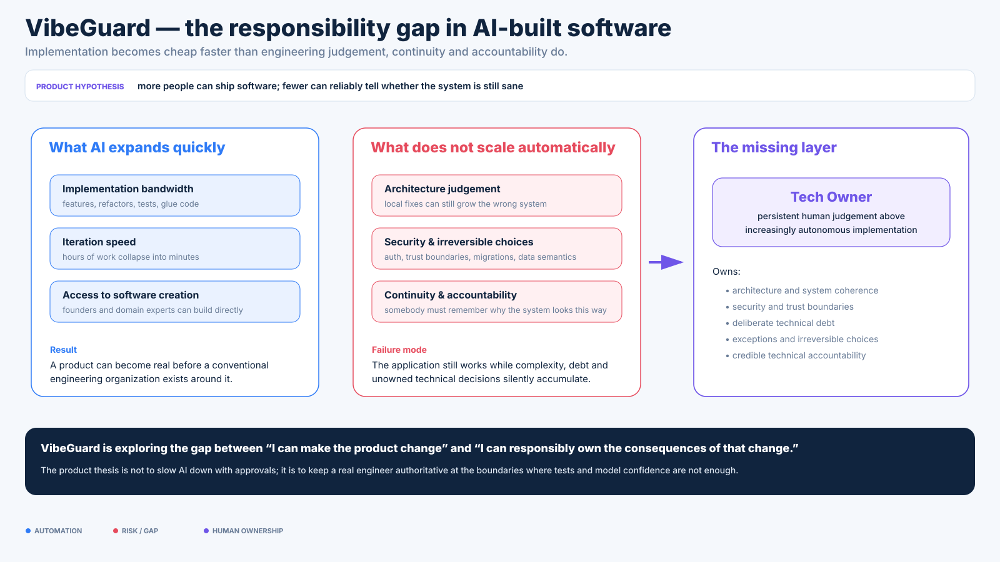
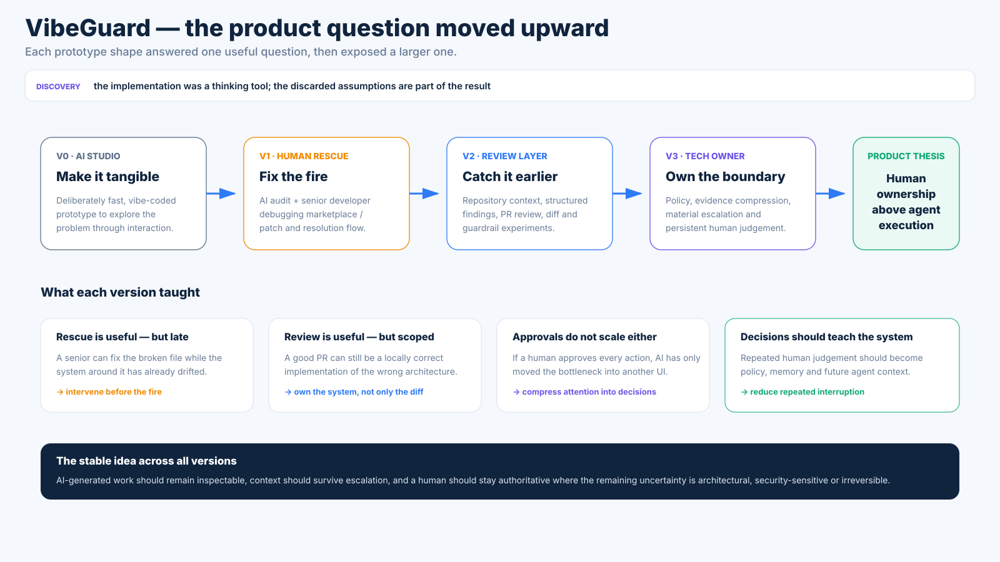

# VibeGuard — discovery: from rescue marketplace to technical ownership

[← Case study overview](../VIBEGUARD.md) · [Evidence](evidence.md) · [Tech Owner model](ownership-model.md) · [Business case](business-case.md) · [Prototype & architecture](prototype.md) · [Visual tour](visual-tour.md)

VibeGuard is useful to me less as a finished product than as a record of a changing question.

The project started from a broad market observation: AI-assisted coding is making it possible for far more people to build software without a conventional software-engineering background.

That creates a new kind of gap.

The problem is not that a model cannot produce code.

The problem is that producing code and **understanding the system that code is turning into** are different skills.

And the difference becomes much more expensive over time.

The real test is not whether an agent can build the next feature today. It is whether the system can absorb changing requirements, survive major refactors and still make sense after a year of accumulated product history.

A founder can keep asking for changes and get plausible local implementations while still lacking the experience to notice when:

- the architecture is fragmenting;
- two generations of a concept now coexist;
- a local workaround should really be a larger refactor;
- infrastructure is being introduced to solve a temporary problem;
- auth or data boundaries have shifted;
- the model is hallucinating a library/API/constraint;
- token usage is rising because the codebase has become harder for the agent itself to reason about;
- a "working" prototype has become expensive to evolve.

The original business instinct behind VibeGuard was simple:

> A lot of people who can now build software will soon want a real engineer to tell them whether what they built is actually sane — and to take responsibility for the technical side.

The repository became a way to explore what that service might look like.

### Why I take this seriously despite not having market proof yet

This is not evidence that VibeGuard is already a business.

It is the source of my conviction that the problem is structurally real.

A recurring pattern in my older learning projects was to get interested in a system by rebuilding enough of the machinery underneath it until the established abstraction stopped looking magical.

Examples from my public repositories:

- **[JustBuild PoC](https://github.com/SzymonZyrek/just_build_poc)** started from local C++ build scripts and gradually separated project description, lifecycle, toolchain invocation, artifacts and dependencies. I did not know Gradle yet; in retrospect the design was moving into a distinctly Gradle-shaped part of the problem space.
- **[FetchDog](https://github.com/SzymonZyrek/fetchdog)** extracted artifact acquisition from the build tool and reframed it as logical artifact → concrete representation → provider/cache/resolution.
- **[Faxus](https://github.com/SzymonZyrek/faxus)** pushed that further into explicit artifact identity, qualifiers, repositories, caches and resolvers.
- **[Meserve](https://github.com/SzymonZyrek/meserve)** reconstructed enough application-runtime/container machinery — metadata, configuration, lifecycle, class loading, events, HTTP — that framework/application-server abstractions became concrete rather than ceremonial.

Those projects are not proof that I independently invented the mature tools around them, and that is not the claim.

Stynk is the stronger, later piece of evidence because it moved the same habit out of toy systems and into a real business.

The company owner initially carried a large amount of operational synchronization in his head. As the CRM evolved, mechanical coordination moved into explicit workflow, notifications and state. Later, repeated pricing and service changes exposed another ownership problem: business variability lived in developer-owned code. The response was not another larger hard-coded feature, but a shift toward a configurable model/runtime where the platform owns execution guarantees and the business increasingly owns the model it changes.

VibeGuard is not a direct continuation of Stynk's code. It is a continuation of that boundary question applied to engineering itself:

> If agents can execute much more work, what should automation own — and what must remain an explicit human decision because it changes the meaning, risk or future shape of the system?

The pattern is simpler:

```text
bump into an abstraction
      ↓
go underneath it
      ↓
rebuild enough to expose the real constraints
      ↓
recognize the shape of the mature solution
      ↓
keep the mental model
```

VibeGuard feels like the same kind of signal.

I am not looking at agentic coding from the outside and guessing that governance might become fashionable.

I have been using agents, building workflows around them, watching codebases change under repeated AI-assisted iteration, and repeatedly hitting the point where **local implementation capability is no longer the interesting problem**.

The interesting problem is preserving a system-level model while the implementation engine gets faster.

That is why my confidence here is stronger than the prototype evidence.

It is still a hypothesis.

But it is a bottom-up hypothesis formed by working under the abstraction rather than a top-down trend prediction.



This is the starting asymmetry: implementation bandwidth rises quickly, while engineering judgement, continuity and accountability remain scarce.

---

## 1. Deliberately start with a vibe-coded prototype

The first repository state was essentially an AI Studio export.

That was appropriate for the question I had at the time.

I did not need a durable multi-tenant platform to learn whether the interaction model was interesting. I needed something visible and clickable enough to ask better questions.

So the first version was deliberately cheap:

```text
idea
 ↓
prompted prototype
 ↓
look at the interaction
 ↓
find what feels wrong
 ↓
change the model
```

That development method is important to the case study.

VibeGuard is not presented as a polished codebase whose architecture should be copied into a production system.

It is a **thinking tool implemented as software**.

---

## 2. V1: human rescue for vibecoders

The initial product model was close to a specialist marketplace.

A vibecoder has a problem.

The system collects enough repository and AI context to make the problem understandable.

An experienced developer claims the work, inspects the code, proposes a patch and resolves the ticket.

The prototype grew around that idea:

- GitHub repository connection;
- branch and file browsing;
- AI code audit;
- structured line annotations;
- drift/risk summaries;
- debug tickets;
- interactive patch/diff review;
- a human-coder marketplace;
- PR review requests.

The implied value proposition was:

> You do not need a permanent senior engineer. Get one when the AI-built codebase becomes confusing or breaks.

That still has value.

But it treats the human as an emergency service.

---

## 3. The first contradiction: the senior arrives too late

The more I looked at the workflow, the less convincing "rescue after failure" became.

A codebase can become unhealthy without producing a clean emergency.

The dangerous state is often:

> everything still sort of works.

A vibecoder asks for Feature A.

The agent builds architecture A.

The concept changes.

The agent adds B on top of A because that is the safest local change.

The concept changes again.

C wraps both.

Nothing is obviously broken, but every future prompt now has to reason through three historical models of the product.

This creates several compounding costs:

```text
concept changes
      ↓
local AI fixes preserve old assumptions
      ↓
architecture accumulates layers
      ↓
context becomes harder to understand
      ↓
agents consume more context / make weaker local decisions
      ↓
changes become more expensive
      ↓
more patches instead of simplification
```

At that point, a senior engineer should not merely fix the latest symptom.

They should say:

> Stop. The model is wrong now. This is the refactor boundary.

That is not debugging.

That is ownership.

This is also where the idea connects to my broader engineering experience: the hardest long-lived systems are rarely hard because nobody can write another function. They become hard because business concepts move, old assumptions survive in code, integrations accumulate, and somebody has to know when incremental change has crossed the point where the model itself must be rewritten.

---

## 4. V2: audit and review before the fire

The next useful step was therefore to move human involvement earlier.

The repository gained concepts that are closer to engineering governance than to a bounty marketplace:

- PR review workflows;
- automatic AI review flags;
- target-branch review configuration;
- code drift scanning;
- guardrail/architecture-rule authoring;
- generated agent instructions;
- explicit security and dependency rules.

This suggested a different flow:

```text
AI-generated change
      ↓
automated inspection
      ↓
structured evidence
      ↓
human review where needed
      ↓
merge / revise
```

That is better than emergency rescue.

But it still leaves another problem.

If the human reviews every PR, AI has not really increased the senior engineer's leverage.

The engineer has just become a manual approval queue.

---

## 5. The second contradiction: human-in-the-loop can become human-as-bottleneck

A literal interpretation of "human in the loop" is easy to build:

> Every important action asks a human for approval.

That is safe but economically weak.

If one senior must read every diff produced by ten coding agents, implementation bandwidth may have increased while delivery bandwidth has not.

The useful question became:

> Which decisions actually need the human?

That changed the unit of work.

Not:

- file;
- ticket;
- PR;
- model response.

But:

- architecture boundary;
- security boundary;
- irreversible data decision;
- material product semantics;
- risk exception;
- change to the rules themselves.

The interface should therefore compress many machine actions into a small number of **material decisions**.

---



The sequence matters because the later ownership model was not the premise used to justify the prototype. It emerged after the rescue and review models exposed their own limits.

## 6. V3: the Tech Owner control loop

The current PoC starts from an explicit division of responsibility.

### Agents own execution inside known boundaries

Examples:

- implement a bounded feature;
- refactor locally;
- add tests;
- iterate on CI failures;
- fix a regression with clear evidence;
- update code while preserving explicit invariants.

### The Tech Owner owns boundary changes

Examples:

- introduce a new infrastructure dependency;
- change auth/account ownership semantics;
- change failure/retry semantics;
- make an irreversible migration;
- cross a security boundary;
- accept meaningful technical debt;
- choose between competing architecture directions;
- change the policy agents will follow next time.

The resulting loop is:

```text
technical policy
      ↓
agent execution
      ↓
CI / tests / automated audit
      ↓
evidence sufficient?
   ├── yes → continue
   └── no / policy crossed
             ↓
         Owner Inbox
             ↓
       human decision
             ↓
  decision record / new policy
             ↓
       future agent context
```

The goal is not to remove human review.

It is to make the human review **decisions rather than implementation volume**.

---

## 7. "Sanity" is part of the product

One theme kept surviving every version of the idea: the service is not only technical verification.

It is also reassurance.

The person vibecoding may know that they do not know enough to evaluate the architecture.

That uncertainty creates a real psychological and business problem.

They may need a trusted engineer to say:

- "This is rough, but sane for this stage."
- "Do not touch this yet; the shortcut is acceptable."
- "This is becoming dangerous."
- "You need to rewrite this subsystem now."
- "The model is inventing complexity."
- "The security boundary is not good enough."
- "Yes, I would be comfortable putting my name behind this technical direction."

That confidence also matters to stakeholders.

A non-technical founder can say:

> Implementation is AI-heavy, but a real senior engineer owns architecture, security and material technical decisions.

This is much stronger than claiming that AI output has been "verified".

It makes responsibility legible.

---

## 8. The prototype itself became evidence for the thesis

There is a useful meta-layer in the project.

VibeGuard began as a fast AI-generated prototype and then accumulated more concepts:

```text
audit
  + debug board
  + marketplace
  + PR review
  + auth
  + universal Git
  + drift scanner
  + guardrails
  + reviewer matching
  + ...
```

That accumulation is not a scandal to hide.

It is exactly what prototypes do when several product hypotheses are explored in the same shell.

At some point the correct move was not:

> polish every old surface.

It was:

> step back, identify the actual valuable human role and create a thinner PoC around that.

The new Tech Owner slice therefore reuses the old prototype opportunistically while refusing to treat its existing architecture as sacred.

If this became a real product, I would expect to redesign major parts from first principles.

---

## 9. What survived the exploration

Several ideas remained useful across all versions.

### Repository context matters

A useful human or AI reviewer should see the actual repo/branch/file context rather than isolated pasted snippets.

### Findings should be structured

A model saying "this seems risky" is weaker than an explicit finding tied to code, evidence and a decision boundary.

### Human escalation must preserve context

The human should not reconstruct the whole problem from zero after automation has already inspected it.

### AI output is not authority

A model finding is evidence. The system still needs an ownership boundary for ambiguous or expensive decisions.

### Technical decisions should leave memory

If the owner repeatedly answers the same question, the system should learn a rule rather than repeatedly consuming senior attention.

### Ownership is continuous

The biggest conceptual shift is from hiring a human to fix a broken thing toward having a human continuously own the technical direction while AI does more execution.

---

## 10. What did not survive

The project also became clearer by discarding ideas.

### Marketplace-first positioning

Interesting, but too narrow as the main story.

The marketplace may still be a useful supply mechanism later:

> no Tech Owner? find one.

But matching senior developers is not the core technical idea.

### Bounty-first debugging

Useful for transactional work, but it encourages late intervention.

### "AI reviewer" as the product

Too easy to collapse into "run another model over the diff".

The more interesting system decides **when another model is not enough**.

### Approval on every change

Safe-looking, but destroys leverage.

The human should be interrupted because a material boundary changed, not because a robot touched a file.

---

## 11. The current question

The current PoC is trying to answer one interaction-design question:

> Can a system give an experienced engineer enough compressed context to make a real technical decision without requiring them to follow every implementation step?

The demo is intentionally fake where fakeness is cheap:

- simulated decision packets;
- session/local state;
- sample evidence;
- simplified decisions.

And concrete where concreteness teaches us something:

- actual UI;
- explicit domain types;
- real diff component;
- real project-policy surface;
- explicit decision actions;
- clear boundary between automatic evidence and human authority.

That is enough for this stage.

The next useful result is not more code.

It is whether the model still makes sense after looking at the workflow as a whole.
