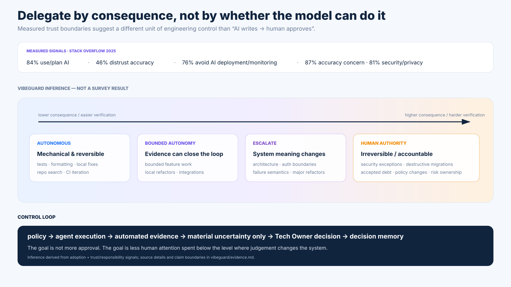

# VibeGuard — external evidence snapshot

[← Case study overview](../VIBEGUARD.md) · [Discovery](discovery.md) · [Tech Owner model](ownership-model.md) · [Business case](business-case.md) · [Prototype](prototype.md) · [Visual tour](visual-tour.md)

> **Research snapshot:** 2026-09-30  
> **Purpose:** test the premises behind the VibeGuard thesis, not manufacture product validation.

The research supports a narrower claim than "VibeGuard has a validated market":

> **AI-assisted implementation capacity is scaling quickly, while trust, high-risk delegation and accountable technical ownership remain materially constrained.**

That is enough to make the workflow problem worth testing.

## The few signals worth keeping

| Signal | Measured fact | Why it matters here |
|---|---|---|
| **AI has become normal infrastructure** | GitHub Octoverse 2025 reports **1.1M+ public repositories using LLM SDKs**, with **693,867 new such repositories in the prior 12 months** and **+178% YoY growth**. | AI is no longer only autocomplete at the edge of development; it is becoming part of the software toolchain itself. |
| **Software-change volume is rising** | GitHub reports **518.7M merged pull requests in 2025, +29% YoY**. GitHub explicitly warns that this is correlation, not proof that AI caused the increase. | More implementation capacity makes review/ownership economics more important even if AI is only one cause of higher change volume. |
| **Adoption is high; trust is not** | Stack Overflow Developer Survey 2025: **84% use or plan to use AI** in development, while **46% distrust AI accuracy** and **33% trust it**. | The interesting problem is no longer "will developers touch AI?" but "what can they safely delegate?" |
| **Responsibility changes the delegation boundary** | In the same survey, **76% do not plan to use AI for deployment/monitoring** and **69% do not plan to use it for project planning**. Among agent users, **87% cite accuracy** and **81% security/privacy** as concerns. | Acceptance drops where mistakes have system-level or operational consequences. |
| **The labor market is adapting** | LinkedIn Economic Graph (Jan 2026) calls **AI Agents the fastest-growing AI engineering skill of 2025**; paid postings requiring AI engineering skills grew **+54% YoY in India** and **+37% in the UK**. | Organizations are hiring for the layer around AI systems, not only consuming generic coding assistants. |
| **Agent-native repo infrastructure is emerging** | The open `AGENTS.md` format reports use by **60k+ open-source projects**. | Repo-level context and agent instructions are becoming a recognizable infrastructure concern. |

## Two visual conclusions

The first is measured ecosystem evidence.

The second is a **VibeGuard inference** from those measurements: autonomy should increase where work is reversible and mechanically verifiable, while human authority should remain strongest where a change alters architecture, security, data semantics or accepted risk.

## Claim boundary

The research does **not** establish:

- demand or willingness to pay for VibeGuard;
- that AI caused all recent increases in repository or PR activity;
- that every organization will need a separate Tech Owner product;
- that human review should remain mandatory for all high-risk work forever;
- that any one current metric predicts VibeGuard revenue.

It does establish enough to justify testing the engineering hypothesis:

> **scaling implementation and scaling judgement are becoming different problems.**

## Sources

- GitHub, **Octoverse 2025** — https://github.blog/news-insights/octoverse/octoverse-a-new-developer-joins-github-every-second-as-ai-leads-typescript-to-1/
- Stack Overflow, **Developer Survey 2025 — AI** — https://survey.stackoverflow.co/2025/ai
- LinkedIn Economic Graph, **AI Labor Market Update — January 2026** — https://economicgraph.linkedin.com/content/dam/me/economicgraph/en-us/PDF/ai-labor-market-update-january-2026.pdf
- AGENTS.md open format — https://agents.md/
- OpenAI, **Codex usage / agentic tooling** — https://openai.com/index/codex-for-knowledge-work/ and https://openai.com/index/introducing-the-agents-api/

OpenAI usage numbers were useful as a scale signal in the research pass, but the primary portfolio slides above deliberately lean more heavily on GitHub, Stack Overflow and LinkedIn because they provide a cleaner mix of ecosystem activity, developer attitudes and labor-market demand.
