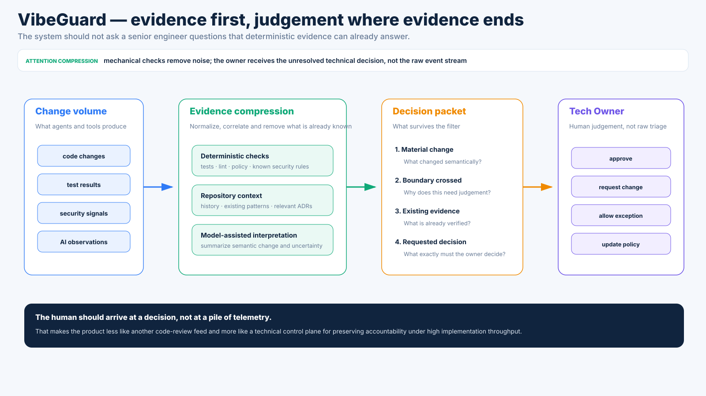

# VibeGuard — Tech Owner model: human judgement above agent execution

[← Case study overview](../VIBEGUARD.md) · [Discovery](discovery.md) · [Prototype & architecture](prototype.md) · [Visual tour](visual-tour.md)

The current VibeGuard thesis is not "put a human in every AI loop".

It is more selective:

> **Let agents execute aggressively inside explicit boundaries; keep an experienced human authoritative over the decisions that redefine those boundaries.**

That human is the **Tech Owner**.

The role combines several things that are often separated in conventional teams:

- architecture sanity;
- security judgement;
- technical-debt control;
- review of irreversible changes;
- detection of AI hallucination/drift;
- explicit risk acceptance;
- continuity of technical decisions;
- reassurance for non-technical founders and stakeholders.

The objective is not to turn the Tech Owner into a high-priced approval button.

The objective is to maximize engineering leverage without losing accountability.


---

## 1. Why code review is not enough

A code reviewer primarily asks:

> Is this implementation acceptable?

A Tech Owner also asks:

> Is this the right implementation boundary?  
> Is this still the right architecture?  
> Is the product concept being represented coherently?  
> Are we introducing a dependency that changes the operating model?  
> Is this shortcut intentional or accidental?  
> Are we creating a future migration nobody has acknowledged?

This distinction matters most when AI is productive.

A coding agent can produce a clean implementation of a bad architectural idea.

Tests may pass.

Lint may pass.

The diff may look reasonable.

The wrongness exists at a higher level.

---

## 2. The ownership boundary

The PoC models responsibility as two zones.

### Autonomous zone

Work can proceed without interrupting the Tech Owner when it is:

- reversible;
- local;
- inside documented architecture;
- mechanically verifiable;
- covered by existing policy;
- low-cost to retry.

Examples:

```text
bounded implementation
local refactor
test additions
obvious bug fix
CI iteration
format/API adaptation inside an existing contract
```

### Owner zone

The Tech Owner is interrupted when a change affects:

- architecture;
- trust/auth/security boundaries;
- irreversible data semantics;
- infrastructure topology;
- externally visible failure semantics;
- meaningful technical-debt acceptance;
- product behaviour that tests cannot define without a decision;
- the policy governing future agent actions.

That is the core routing function of the product.

---

## 3. Project Policy: make the implicit architecture explicit

The first PoC surface is **Project Policy**.

It represents things that experienced engineers often carry in their heads:

- architectural invariants;
- forbidden or discouraged dependencies;
- security rules;
- classes of change requiring approval;
- autonomy level;
- explicit exceptions.

Example:

```text
ARCHITECTURE
- keep request handling stateless
- prefer current infrastructure before adding a new runtime dependency
- external side effects happen after transaction commit

SECURITY
- secrets remain server-side
- public endpoints require explicit auth review
- payment callbacks must be signature-verified

OWNER APPROVAL REQUIRED
- new infrastructure
- auth boundary changes
- irreversible migrations
- payment failure-semantics changes
```

The important property is not the exact format.

It is that the rules are both:

1. legible to the human;
2. usable as context for automated review.

---

## 4. Owner Inbox: compress implementation into decisions

The second surface is the **Owner Inbox**.

It should not be a generic PR list.

It should contain only situations where automation has evidence but not authority.

A useful entry answers:

```text
WHAT CHANGED?
WHY IS THIS MATERIAL?
WHICH BOUNDARY WAS CROSSED?
WHAT EVIDENCE ALREADY EXISTS?
WHAT DECISION IS REQUESTED?
```

For example:

```text
Agent introduced Redis for async payment processing

Why you are seeing this:
- new runtime dependency
- payment failure semantics changed

Evidence:
✓ unit/integration tests pass
✓ security scan found no new secret exposure
⚠ adds Redis + worker process
⚠ changes failure from request-time to eventual retry

Relevant history:
ADR-014: avoid queues until reliability/traffic evidence justifies one
```

The human should arrive at the trade-off, not at the beginning of the investigation.



---

## 5. Decision Workspace: judgement, not ceremony

The third surface is the **Decision Workspace**.

The PoC currently models four owner actions:

- **Approve architecture change**
- **Request simpler implementation**
- **Allow one-off exception**
- **Update technical policy**

Those actions deliberately distinguish several different meanings.

### Approve

The change is acceptable and consistent with the desired direction.

### Request change

The product intent may be valid, but the implementation/architecture should be reconsidered.

### Allow exception

The owner knowingly accepts a local violation without changing the general rule.

### Update policy

The old rule is no longer correct; future agents should reason from a new boundary.

That last action is particularly important.

The owner is not merely deciding the current PR.

They are changing the future execution environment.

---

## 6. Decision memory

A production version should preserve why important technical choices were made.

The desired feedback loop is:

```text
material change
      ↓
owner decision
      ↓
rationale
      ↓
decision record / ADR
      ↓
future review context
      ↓
fewer repeated interruptions
```

This changes the economics of senior attention.

The first time an agent proposes a new class of change, the owner may need to reason carefully.

The fifth time, the system should already know the policy.

The long-term objective is therefore not maximum human involvement.

It is **minimum repeated human involvement without losing technical intent**.

---

## 7. Attention compression as a design goal

Implementation bandwidth from agents can become enormous compared with one senior engineer's reading bandwidth.

That means the central UI problem is compression.

A poor system says:

> Here are 37 PRs. Please review them.

A better system says:

> 34 changes stayed inside policy and passed verification. Three changed a material boundary. Here is the evidence for those three.

The PoC illustrates this with a deliberately simplified metric:

```text
20 observed agent changes
17 auto-passed inside policy
3 promoted to owner decisions
```

Those numbers are demo data, not measured product performance.

The point is the shape of the interface.

---

## 8. Sanity and anti-hallucination

AI hallucination in software is not limited to fake method names.

There are several levels.

### Local hallucination

- nonexistent API;
- invented import;
- wrong parameter;
- false assumption about a library.

These are often catchable mechanically.

### System-level hallucination

- treating an obsolete abstraction as still authoritative;
- assuming two concepts are equivalent because names are similar;
- inventing a service boundary because that pattern seems conventional;
- preserving accidental complexity because it exists in context;
- underestimating the real scope of a refactor.

These require broader context.

### Product-level hallucination

- implementing behaviour nobody actually decided;
- treating an ambiguous business rule as if it were specified;
- making a migration decision that destroys legitimate historical states.

Those are not primarily code problems.

They are ownership problems.

VibeGuard's intended escalation model gets stricter as the uncertainty moves upward.

---

## 9. Technical debt as an explicit trade-off

Technical debt is not automatically bad.

A good Tech Owner sometimes says:

> Yes, this is ugly. Ship it.

The important difference is whether the shortcut is:

- visible;
- intentional;
- bounded;
- recorded;
- revisited when its assumptions expire.

The PoC therefore treats **exception** as a first-class decision rather than pretending every accepted change complies perfectly with policy.

That is closer to real engineering.

---

## 10. Security and irreversible choices

Some changes deserve human authority even if an AI security scan is excellent.

Examples:

- identity linking;
- access-control semantics;
- secret boundaries;
- destructive migration;
- financial side effects;
- external trust relationships;
- data-retention behaviour.

Automation can collect evidence.

It cannot manufacture product authority where the specification does not exist.

The Tech Owner is the explicit authority boundary.

---

## 11. Stakeholder confidence

There is also a non-code value proposition.

A vibecoded company may need to answer:

> Who is actually responsible for the technical system?

"Claude" or "Codex" is not a satisfying governance answer.

A persistent Tech Owner provides a human accountability story:

```text
Founder / domain owner
      ↓
defines product intent

AI / agents
      ↓
produce implementation

VibeGuard
      ↓
collects evidence + detects decision boundaries

Tech Owner
      ↓
owns architecture, risk and technical policy
```

The service can therefore become a trust signal for:

- investors;
- enterprise customers;
- partners;
- acquirers;
- future engineering hires.

The product should be careful not to turn that into meaningless certification theatre.

Any trust signal must be backed by an actual ownership process and an auditable decision trail.

---

## 12. Tech Owner as a service

The earlier human-coder marketplace is not necessarily useless.

It may simply belong later in the model.

The better framing is not:

> hire a senior for one debugging ticket.

It is:

> **this project needs a Tech Owner.**

A future service could match a project with an engineer who:

- reviews the technical policy;
- establishes boundaries;
- receives escalations;
- performs periodic health reviews;
- accepts/rejects material architecture changes;
- signs off on defined risk areas;
- leaves decision history for future engineers.

Marketplace mechanics become supply infrastructure for ownership rather than the product's central idea.

---

## 13. What the PoC is testing

The current prototype is not testing whether senior developers can review code.

We already know they can.

It is testing whether the interface can move the human to a better abstraction level.

The key questions are:

- Can policy express enough technical intent to route decisions usefully?
- Can automated evidence remove most low-value review work?
- Can an escalation explain why the owner is needed?
- Can past decisions reduce future interruptions?
- Can one engineer maintain technical ownership over substantially more AI-generated implementation than they could personally write/review line-by-line?
- Can that process create credible confidence for people outside engineering?

Those are the questions worth learning before building production infrastructure.
