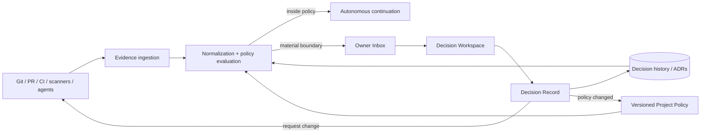

# VibeGuard — prototype, architecture and claim boundary

[← Case study overview](../VIBEGUARD.md) · [Evidence](evidence.md) · [Discovery](discovery.md) · [Tech Owner model](ownership-model.md) · [Business case](business-case.md) · [Visual tour](visual-tour.md)

VibeGuard is intentionally a prototype-heavy project.

This page separates:

1. what the existing application actually implements;
2. what the new Tech Owner PoC simulates;
3. what would need to be rebuilt for a real product.

That boundary matters more here than polishing the prototype into something it is not.


The implementation is evidence that the idea was explored materially. The newer ownership slice is evidence that the interaction model can be made concrete. Neither is presented as the final production architecture.

---

## 1. The existing prototype

The current private repository contains a full-stack TypeScript application.

### Frontend

- React 19;
- TypeScript;
- Vite;
- Tailwind CSS;
- Lucide icons;
- interactive diff rendering via the `diff` package.

### Backend

- Express;
- server-side GitHub REST calls;
- server-side Google GenAI SDK integration;
- prototype REST endpoints for audit, tickets, PR-review state and auth/demo flows.

### Packaging / execution

- Docker multi-stage build;
- development/test/production-style Compose configurations;
- TypeScript typecheck script;
- Vite frontend build;
- esbuild server bundle;
- non-root production container user;
- health check endpoint.

These are real repository capabilities, not portfolio-only diagrams.

---

## 2. Repository inspection

The prototype can operate against repository context rather than only pasted code snippets.

Implemented surfaces include:

- GitHub user/repository connection;
- repository metadata;
- branch listing;
- directory/file browsing;
- source-file loading;
- issue/PR inspection paths;
- experimental provider abstraction/fallbacks for other Git hosts.

The strongest implemented path is GitHub.

Some "universal Git" behaviour uses synthetic fallbacks when provider APIs are unavailable.

That is prototype convenience, not a production claim.

---

## 3. AI-assisted audit

The server-side AI path keeps the model credential outside the browser.

The current audit flow is roughly:

```text
repository / file context
        ↓
Express server
        ↓
Google GenAI SDK
        ↓
structured audit response
        ↓
risk/drift summary
        +
line-level findings
        +
suggested fixes
        ↓
review UI
```

The model is asked to identify classes such as:

- bugs;
- hallucinated imports/parameters;
- security issues;
- technical debt;
- overengineering;
- good practice.

The useful implementation decision is the structure.

Findings can be attached to concrete lines and carried into a later human-review flow instead of remaining free-form chat output.

---

## 4. Diff and human-debug flow

The prototype includes an interactive `DiffVisualizer`.

It supports a code-review style interaction around original and patched code.

The older human-debug workflow carries context such as:

- repository;
- branch;
- file;
- selected lines;
- original source;
- AI audit findings;
- ticket description;
- proposed human patch;
- comments;
- status.

This was originally designed around the "human rescue" model.

The newer Tech Owner PoC reuses the diff capability as evidence for a material decision.

---

## 5. PR review and guardrails

The repository also contains two pieces that directly informed the Tech Owner direction.

### PR review board

The prototype stores target branches and flags for automatic AI review / human review requests.

The PR surface carries:

- repo/branch information;
- diff summary;
- audit summary;
- review state;
- original vs patched code;
- reviewer assignment.

### Guardrail builder

A separate component experiments with architecture and coding constraints, including ideas such as:

- architecture boundaries;
- forbidden dependencies;
- secret policy;
- type-safety rules;
- custom directives;
- generated agent instructions.

Those two experiments together suggest the ownership loop:

```text
explicit policy
      +
change evidence
      ↓
decision boundary
      ↓
human judgement
```

---

## 6. The fresh Tech Owner PoC

The `poc/tech-owner-loop` branch adds a deliberately thin demo slice.

### Domain concepts introduced

- `ProjectPolicy`
- `TechnicalDecision`
- `EvidenceItem`
- `DecisionOption`
- `DecisionRecord`

### Demo surfaces

- Project Policy;
- Owner Inbox;
- Decision Workspace.

### Demo scenarios

The current fixtures include examples such as:

- introducing Redis/worker infrastructure for payments;
- adding OAuth/account linking;
- making a historical field mandatory through a migration.

Each scenario includes:

- change summary;
- why the owner is needed;
- changed technical boundary;
- evidence items;
- original/proposed code;
- optional previous decision;
- explicit decision options.

---

## 7. What is simulated in the Tech Owner PoC

The following are intentionally **not** production implementations:

- real webhook/event ingestion into the Owner Inbox;
- durable decision storage;
- persistent project policy;
- real ADR synchronization;
- automatic policy propagation to coding agents;
- measured evidence compression;
- real agent-autonomy routing;
- certification/attestation;
- stakeholder dashboards;
- billing or ownership contracts.

The demo uses mock decision packets and local/session UI state.

That is enough for an interaction prototype.

---

## 8. What is also prototype-grade in the older application

Several older capabilities are useful demos but would not survive unchanged into production.

### In-memory workflow state

Debug tickets and PR-review state are stored in process memory.

A real product needs durable storage, concurrency handling and audit history.

### Simulated auth paths

There are demo/simulated login flows.

A production system needs explicit OAuth/session/account boundaries.

### Marketplace data

Human-coder profiles, rates and matching are primarily product-concept fixtures.

### Provider fallbacks

Some non-GitHub repository/provider behaviour is synthetic.

### AI audit evaluation

The application can call a model and render findings, but it does not yet contain the evaluation harness required to measure false positives, localization quality or fix usefulness systematically.

These are exactly the kinds of gaps a prototype should expose.

---

## 9. Security choices already present

Even as a PoC, a few boundaries are deliberate.

### Server-side AI credentials

`GEMINI_API_KEY` is kept in the server environment and AI requests are proxied through Express.

The browser is not meant to receive the key.

### Environment template

Secrets/configuration are documented through `.env.example`.

### Container hardening

The production-style Docker image creates a non-root user and includes a health check.

These do not make the application production-secure.

They show that even exploratory code can keep obvious trust boundaries explicit.

---

## 10. What I would rebuild for production

I would not treat the current prototype architecture as a product foundation simply because code already exists.

A real implementation should start from the ownership model.

### Durable event/evidence ingestion

Likely inputs:

- PR events;
- CI checks;
- code-review findings;
- dependency/security scanners;
- migration plans;
- agent execution logs;
- architecture-policy checks.

The system should normalize these into evidence without turning every tool into a separate source of truth.

### Durable decision model

A real `TechnicalDecision` needs:

- immutable identifiers;
- project/repository references;
- source event;
- policy boundary;
- evidence snapshot;
- requested authority;
- owner identity;
- outcome;
- rationale;
- exception expiry if applicable;
- linked ADR/policy update;
- audit timestamps.

### Policy model

Policy must be versioned.

A decision made under Policy v4 should remain understandable after Policy v7 exists.

### Real identity and authorization

Who may:

- define policy;
- become Tech Owner;
- approve a high-risk change;
- create an exception;
- view private source/evidence;
- attest to project health?

Those need explicit roles and audit trails.

### Evaluation

The product needs to prove that escalation is useful.

A serious evaluation harness should measure:

- false-positive escalation;
- missed material changes;
- owner agreement;
- repeated decision classes;
- context reconstruction time;
- policy effectiveness;
- human attention saved.

### Repository-native integration

Git should remain the durable engineering substrate where possible.

VibeGuard should add ownership/evidence semantics around:

- commits;
- PRs;
- checks;
- review comments;
- issues;
- ADRs.

It should not invent a parallel software-delivery universe unless necessary.

---

## 11. Architecture direction

A plausible future architecture is:



The hard part is not drawing this diagram.

The hard part is determining which decisions can be classified reliably enough that the Tech Owner trusts the filter.

That is why the current PoC focuses on the interaction first.

---

## 12. Why keep the old prototype at all?

Because it contains evidence of the reasoning path.

It shows that the current Tech Owner framing was not invented as a portfolio slogan and then illustrated with mockups.

The idea emerged through concrete experiments with:

- repository context;
- AI findings;
- human debugging;
- PR review;
- guardrails;
- marketplace/routing;
- diff interaction.

Some of those concepts will probably disappear in a rewrite.

They have still earned their keep by helping expose the more useful model.

---

## 13. Claim boundary

For this portfolio I am comfortable claiming:

> I built and iterated a working prototype around AI-assisted repository inspection, audit, diff/review and human escalation, then used that prototype to explore a broader Tech Owner control-loop model.

I am **not** claiming:

> VibeGuard is a production-ready AI governance platform.

The distinction is deliberate.

The interesting engineering signal is the ability to use implementation to test a systems hypothesis, recognize when the original abstraction is too small, and change the model before hardening the wrong product.
