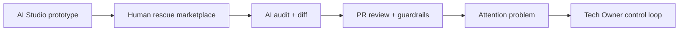
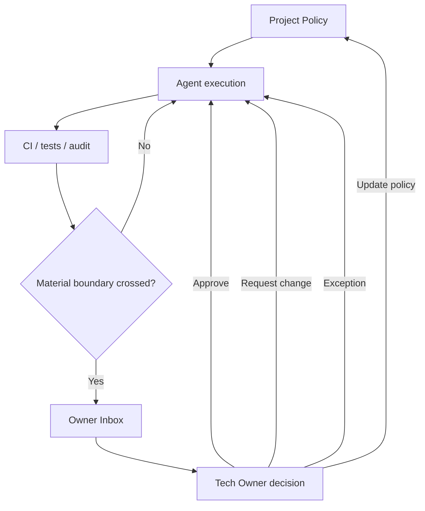

# VibeGuard — visual tour

[← Case study overview](../VIBEGUARD.md) · [Discovery](discovery.md) · [Tech Owner model](ownership-model.md) · [Prototype & architecture](prototype.md)

This page is the planned shortest visual route through the case study.

The current Tech Owner slice is a fresh PoC, so the screenshots should make that explicit rather than trying to look like production telemetry.

## 1. Project Policy

**Story:** make architectural intent explicit before asking agents to act autonomously.

Capture the PoC with:

- project name / Tech Owner;
- autonomy mode;
- architectural invariants;
- "always requires owner approval" rules;
- security boundaries.

Suggested caption:

> The Tech Owner defines the boundaries inside which agents can execute without interrupting a human.

Target asset:

`assets/vibeguard/01-project-policy.png`

---

## 2. Owner Inbox

**Story:** compress implementation volume into the small number of changes that actually require senior judgement.

The strongest screen should show several different decision classes, for example:

- new infrastructure + changed failure semantics;
- identity/account-ownership boundary;
- irreversible migration/data semantics.

The right-hand "attention compression" and decision-memory cards should remain visible.

Suggested caption:

> Most changes should disappear into automated evidence. The Owner Inbox contains only material boundary crossings.

Target asset:

`assets/vibeguard/02-owner-inbox.png`

---

## 3. Decision Workspace

**Story:** when the human is interrupted, arrive with evidence rather than a raw diff and a vague question.

The screenshot should include:

- "why the system interrupted the Tech Owner";
- previous owner decision / ADR context;
- evidence packet;
- meaningful diff;
- owner actions.

Suggested caption:

> The owner sees why the change matters, what has already been verified, relevant historical intent and the concrete decision being requested.

Target asset:

`assets/vibeguard/03-decision-workspace.png`

---

## 4. Historical VibeGuard prototype — optional

One historical screenshot can help explain the discovery path.

A good candidate is either:

- AI Code Auditor with line findings; or
- Human Debug Workspace with patch/diff.

This should be labelled as the **earlier rescue/review model**, not mixed with the new Tech Owner flow.

Suggested caption:

> Earlier VibeGuard experiments focused on AI audit and human rescue. That work exposed the larger question of continuous technical ownership.

Target asset:

`assets/vibeguard/04-historical-audit-or-debug.png`

---

## 5. Evolution diagram

This diagram can be rendered directly in Markdown or turned into an SVG later.



Caption:

> The product question moved upward: from "who fixes AI code?" to "who owns the technical system while AI implements it?"

---

## 6. Ownership loop diagram



Caption:

> Human judgement is retained at architecture, security, irreversible-data and policy boundaries instead of every implementation step.

---

## Screenshot hygiene

Before publishing:

- keep the "Fresh PoC / simulated decision flow" label visible;
- do not imply the sample evidence is measured production data;
- use one consistent viewport;
- avoid private repository names or tokens;
- prefer readable demo code over realistic-but-illegible production files;
- show one coherent scenario across the Inbox and Decision Workspace if possible;
- crop enough browser chrome to make the product legible, but do not fake a production deployment.

A 1440×900 desktop capture should be a good starting point.

---

## Suggested portfolio order

```text
Project Policy
      ↓
Owner Inbox
      ↓
Decision Workspace
      ↓
historical prototype (optional)
      ↓
evolution + architecture diagrams
```

That order tells the current product story first and only then explains where it came from.
