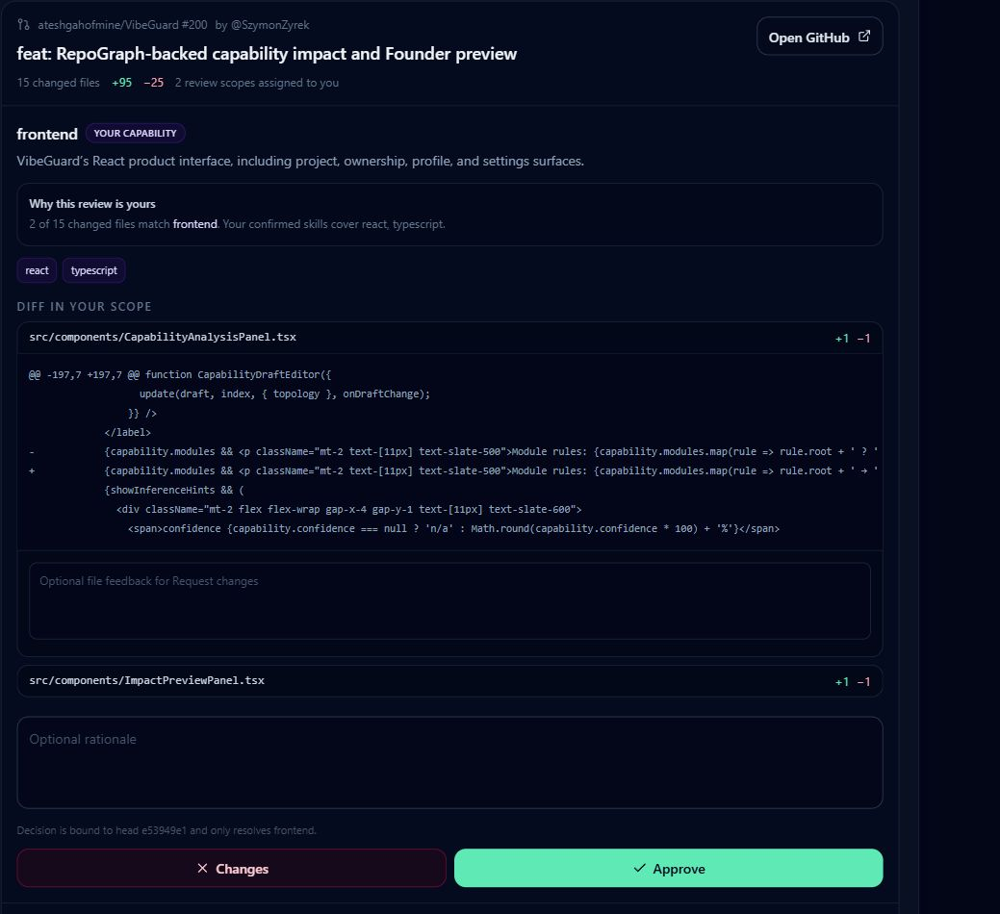
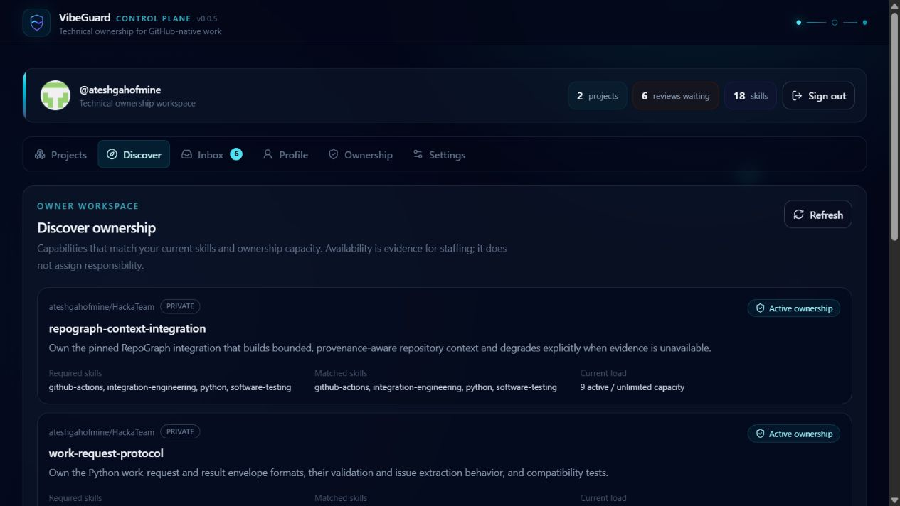
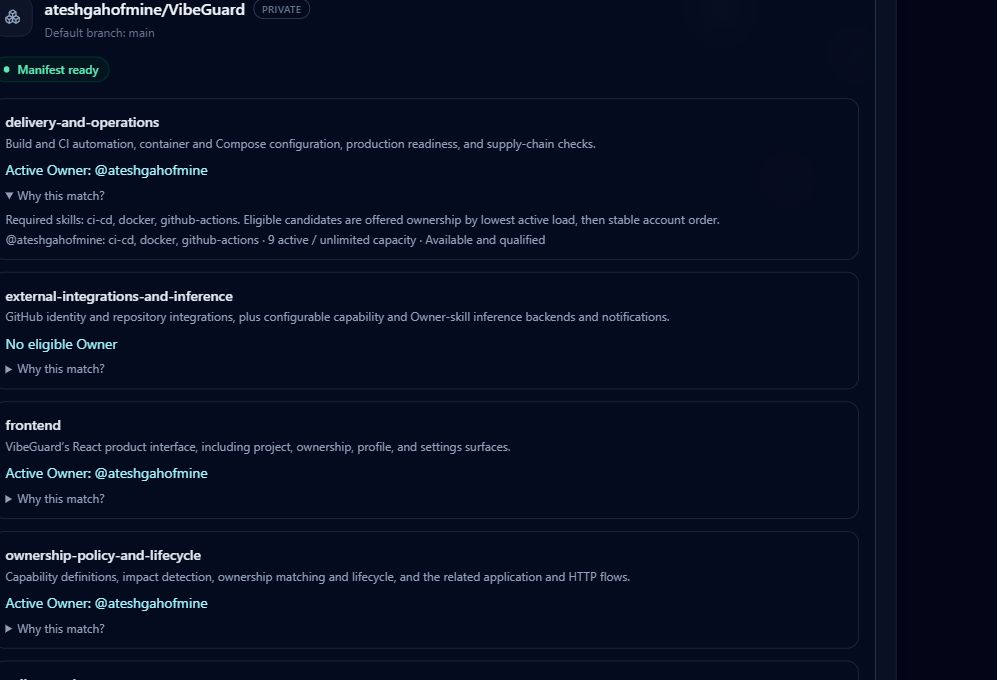
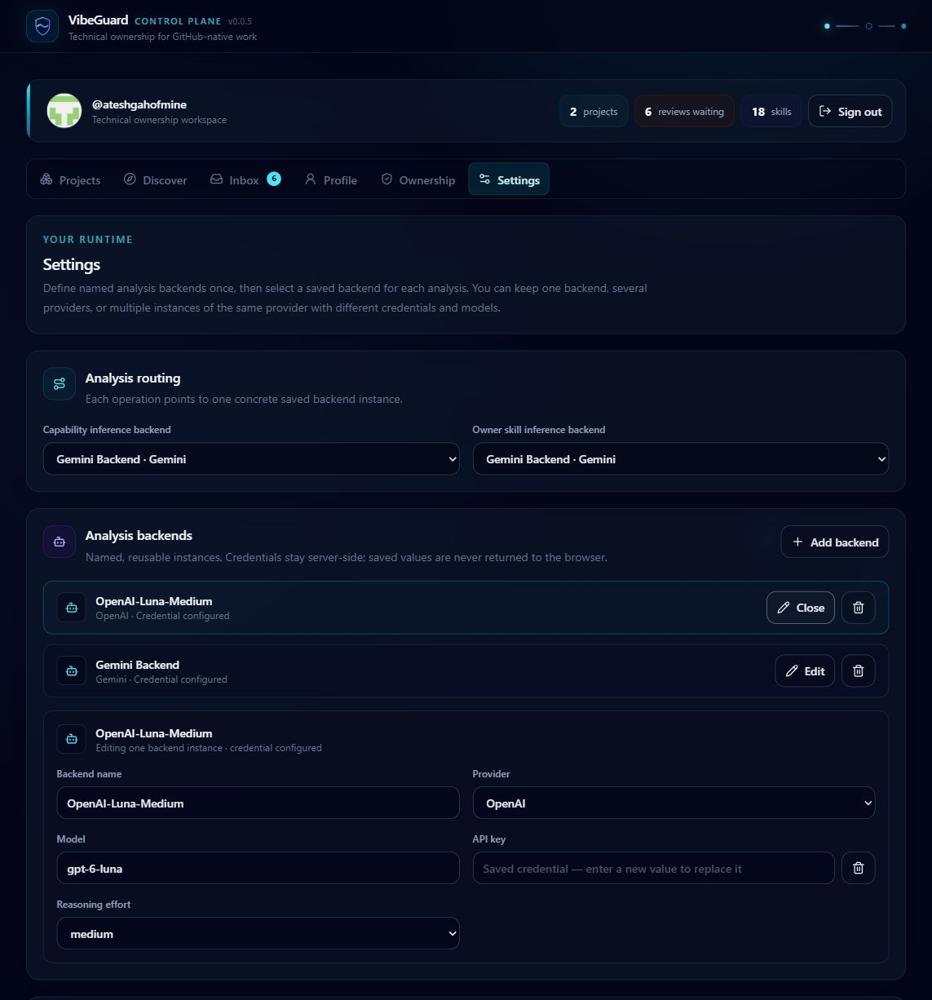

# VibeGuard — visual tour

[← Case study overview](../VIBEGUARD.md) · [Evidence](evidence.md) · [Discovery](discovery.md) · [Tech Owner model](ownership-model.md) · [Business case](business-case.md) · [Prototype](prototype.md)

This is the shortest visual path through the idea.

VibeGuard remains R&D, with an implemented authenticated ownership/review workflow. The tour starts with actual application captures, then explains the problem model, evidence, control loop and claim boundary.

## The working product — 2026-10-04

Actual screenshots from an authenticated local workspace with real GitHub project and PR context. These show product behavior, not market validation or a production-readiness claim.

### Review the capability, with the exact PR context

A real PR diff is grouped into the Owner’s capability scope. The UI explains why the work is theirs and binds the decision to the PR head and that capability.

### Make technical responsibility visible

Discover shows required and matched skills together with current ownership load. Eligibility is evidence for staffing; responsibility still requires an explicit offer and acceptance.

### Explain the match instead of inventing a score

Founder coverage exposes active Owners and staffing gaps. “Why this match?” shows skill requirements, qualification, capacity and deterministic candidate ordering.

### Keep analysis configurable and authority human

Named OpenAI and Gemini backends can serve the two inference operations independently. Model suggestions remain advisory; human confirmation and deterministic runtime rules retain authority.

[Complete application screenshot gallery →](https://github.com/ateshgahofmine/VibeGuard/blob/main/docs/ux/screenshots/README.md)

---

## 1. The responsibility gap

AI expands implementation bandwidth faster than it expands architecture judgement, continuity or accountability.

The product question is not whether an LLM can write code.

It is:

> **Who owns the technical system when implementation itself is increasingly delegated?**

---

## 2. The engineering model

Models, skills and plugins improve local implementation capability.

The harder layer is keeping an AI-heavy system coherent through changing requirements, large refactors, migrations, security decisions and another year of product history.

That is the layer VibeGuard is aimed at.

---

## 3. External evidence: the premise is real

The research pass does **not** validate VibeGuard demand.

It does support the premise:

- AI-assisted development is already mainstream;
- AI-native repository/tooling activity is growing quickly;
- overall software-change volume is rising;
- trust drops sharply around consequential work;
- AI-agent skills are appearing in labor-market demand.

[Research snapshot & sources →](evidence.md)

---

## 4. The proposed delegation boundary

This slide is explicitly an inference, not a survey result.

The proposed split is:

~~~text
reversible + mechanically verifiable
        → automate aggressively

material architecture / security / semantics
        → package evidence and escalate

irreversible / accepted risk / policy change
        → explicit human authority
~~~

The goal is not "human approval everywhere".

It is **human judgement where the meaning of the system changes**.

---

## 5. How the idea evolved

The product question moved upward:

~~~text
AI Studio prototype
   ↓
human rescue marketplace
   ↓
AI audit + structured findings
   ↓
PR review + guardrails
   ↓
human attention becomes the bottleneck
   ↓
persistent Tech Owner
~~~

The useful result is the sequence of assumptions that became too small.

[Discovery & evolution →](discovery.md)

---

## 6. The Tech Owner control loop

Agents execute inside known boundaries.

Tests, CI, scanners and automated review absorb mechanical verification.

Only material uncertainty reaches the Tech Owner.

### Evidence before judgement

The human should receive a compressed decision packet:

- what materially changed;
- which boundary was crossed;
- what is already verified;
- which previous decision matters;
- what uncertainty remains;
- what authority is requested.

[Tech Owner model →](ownership-model.md)

---

## 7. Why this can matter commercially

If implementation becomes cheaper, more real-world software becomes worth building.

But if every generated change still requires traditional senior review, judgement becomes the new throughput ceiling.

The business hypothesis is therefore:

> **use automation to scale execution, and experienced engineers to scale technical ownership.**

The stakeholder-facing version is simpler:

> **There is a pilot in this plane.**

[Business case →](business-case.md)

---

## 8. What is actually built

The earlier prototype explored repository inspection, AI audit, structured findings, diffs, debug/PR flows and guardrails. The current implementation has moved to GitHub identity/App integration, confirmed capabilities, persisted ownership lifecycle and capability-scoped review.

The earlier Tech Owner interaction slice was deliberately smaller:

~~~text
Project Policy
      ↓
Owner Inbox
      ↓
Decision Workspace
~~~

Those earlier decision packets were simulated. The current workspace captures above show the later authenticated implementation: accepted responsibility, deterministic routing and real PR review context. Broader policy automation and the execution-provider loop remain separate product work.

[Prototype & claim boundary →](prototype.md)

---

## 9. The whole thesis in one loop

~~~text
business intent
      ↓
coding agents
      ↓
implementation
      ↓
automated evidence + policy
      ↓
material uncertainty only
      ↓
Tech Owner
      ↓
decision / rationale / exception / policy change
      └────────────→ future agent context
~~~

Success is not "maximum autonomy" and not "maximum review".

It is:

> **more useful software per unit of scarce senior attention without losing technical accountability.**

[Back to case-study overview →](../VIBEGUARD.md)
