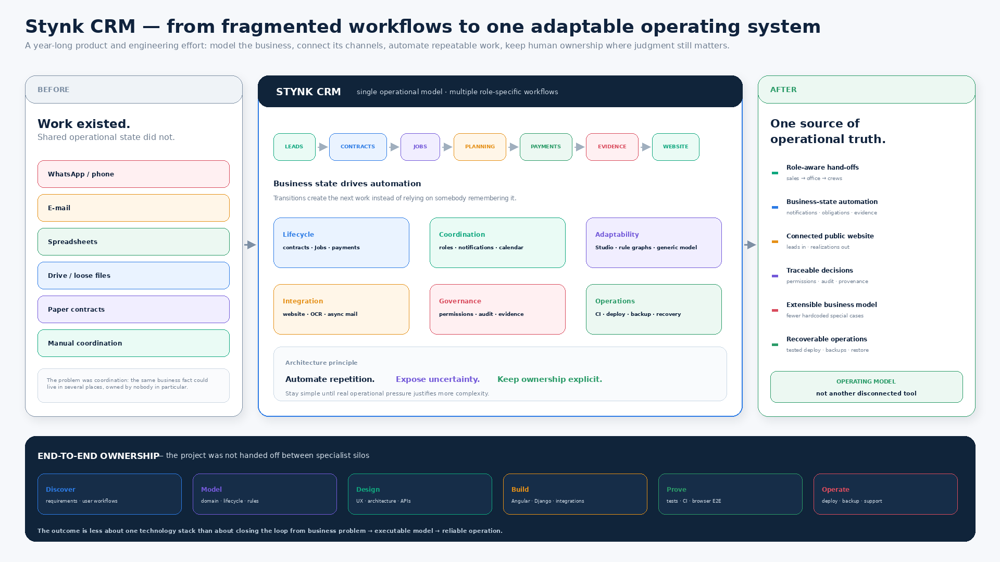
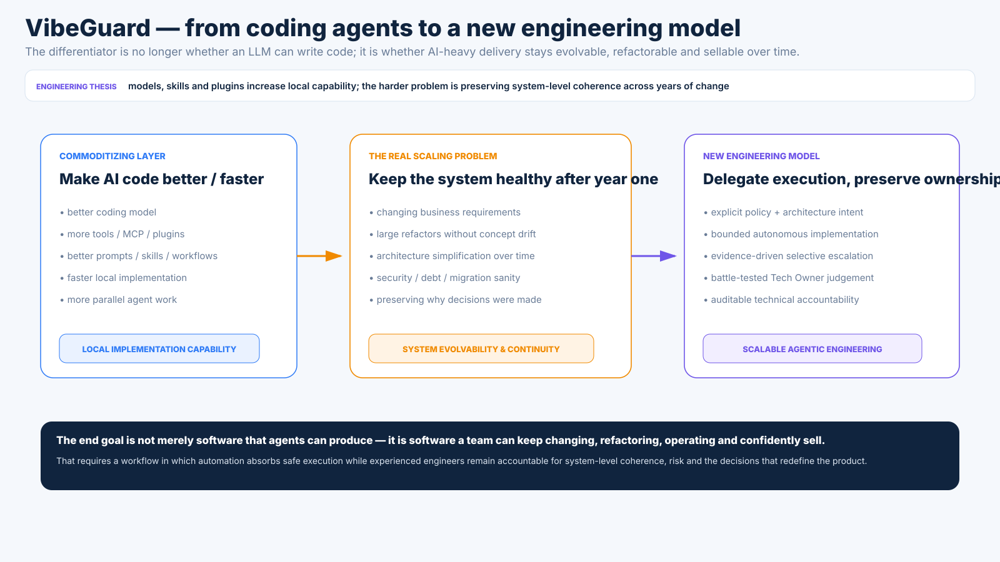

# Szymon Żyrek

**Software / Systems Architect · Senior Software Engineer**

**[CV / Resume (PDF)](Szymon_Zyrek_CV.pdf)** · **[Commercial engineering history](CAREER.md)** · **[Project map](PROJECTS.md)** · **[Engineering archaeology](HOBBY_PROJECTS.md)**  
**Email:** [stynkdev@gmail.com](mailto:stynkdev@gmail.com) · [szyrek@stynk.eu](mailto:szyrek@stynk.eu)

I build systems where product, domain, architecture, implementation and operations remain connected.

Across 12+ years of professional engineering, I have worked from embedded/storage software and C++/Java financial systems through cloud platforms, full-stack product development and production operations to current agentic software-engineering workflows.

A recurring habit is moving up and down abstraction layers until the system stops feeling magical — then choosing the simplest boundary that survives contact with reality.

## Start here

| If you want to see… | Best entry point |
|---|---|
| **End-to-end product and system ownership** | **[Stynk CRM case study](CASE_STUDIES/STYNK_CRM.md)** · [visual tour](CASE_STUDIES/stynk/visual-tour.md) · [discovery/evolution](CASE_STUDIES/stynk/discovery.md) |
| **My current agentic-engineering product thesis** | **[VibeGuard case study](CASE_STUDIES/VIBEGUARD.md)** · [visual tour](CASE_STUDIES/vibeguard/visual-tour.md) · [evidence](CASE_STUDIES/vibeguard/evidence.md) |
| **What I built professionally when the code is private** | **[Commercial engineering history](CAREER.md)** |
| **The wider map of active and historical projects** | **[PROJECTS.md](PROJECTS.md)** |
| **Why I keep rebuilding abstractions for fun** | **[HOBBY_PROJECTS.md](HOBBY_PROJECTS.md)** — including the old game-engine, event-system, build-tool and runtime experiments |

## Primary case study — Stynk CRM

Stynk is the clearest example of how I work when I own the whole feedback loop.

It started as a request to capture data from a paper contract and evolved, through production use, into a role-aware operating system for sales, contracts, jobs, planning, files, payments, commissions, notifications, audit and a public website. Repeated business variation then pushed the architecture toward configurable Jobs, typed models, versioned pricing semantics and Studio-authored executable policy.

[](CASE_STUDIES/STYNK_CRM.md)

**[Read the case study →](CASE_STUDIES/STYNK_CRM.md)** · **[Open the visual tour →](CASE_STUDIES/stynk/visual-tour.md)** · [full-size closing synthesis](CASE_STUDIES/assets/stynk/slides/stynk_case_study_summary.png)

## Current thesis — VibeGuard

If Stynk is the production proof, VibeGuard is the forward-looking engineering thesis.

It explores how AI-heavy software delivery can scale without turning senior engineers into permanent diff reviewers or leaving architecture, security and irreversible technical choices effectively ownerless. The current model separates routine execution and mechanical evidence from the smaller set of decisions that still need explicit human technical authority.

[](CASE_STUDIES/VIBEGUARD.md)

**[Read the case study →](CASE_STUDIES/VIBEGUARD.md)** · **[Open the visual tour →](CASE_STUDIES/vibeguard/visual-tour.md)** · [Tech Owner model](CASE_STUDIES/vibeguard/ownership-model.md) · [evidence](CASE_STUDIES/vibeguard/evidence.md)

## Current R&D and public tools

| Project | What it explores |
|---|---|
| **[HackaTeam](https://github.com/ateshgahofmine/HackaTeam)** | GitHub-native, self-hosting agentic software-development loop: workflow architecture, evaluation, local/hosted execution and evidence-driven coordination |
| **[github_manager](https://github.com/SzymonZyrek/github_manager)** | Narrowly scoped MCP server for explicit GitHub administration capabilities; capability boundaries, TypeScript, Docker and CI |
| **[MLFramework](https://github.com/SzymonZyrek/MLFramework)** | Model-backend abstraction and reusable training/workflow infrastructure |
| **[neural-networks-labs](https://github.com/SzymonZyrek/neural-networks-labs)** | Hands-on ML/NN experiments from gradient descent and backpropagation through computer vision and transformers |

Most experimental runner/integration infrastructure lives under my R&D account, **[ateshgahofmine](https://github.com/ateshgahofmine)**.

## One engineering thread

The projects are less random than the technology list makes them look.

```text
game10 / realtime engine + rendering
        ↓
data locality, frame budgets, C++ constraints
        ↓
events / concurrency / build-system experiments
        ↓
artifact resolution + application-runtime archaeology
        ↓
large enterprise systems + platform integration
        ↓
end-to-end product ownership in Stynk
        ↓
ML / model lifecycle / local agents
        ↓
HackaTeam + VibeGuard
```

The old **[game10 thread](HOBBY_PROJECTS.md#game10-realtime-engine-and-rendering-sandbox)** matters here. Coming from Spring/Angular-style web development, writing a realtime C++ engine made it very obvious that familiar object-heavy patterns are not universal truths: memory layout, predictable work and a frame budget can completely change what “good architecture” means.

That same habit later showed up in **[java_events → cpp_events → JustBuild → FetchDog → Faxus → Meserve](HOBBY_PROJECTS.md)**: rebuild enough of an abstraction to understand the constraints underneath it, then go back to the mature tool with a better model.

## Commercial engineering

Most commercial code is private, so **[CAREER.md](CAREER.md)** presents the product and engineering history directly.

- **Intel** — embedded/storage-driver software, NAND verification and internal tooling near the hardware boundary.
- **Misys / Finastra** — TopOffice, KGR, CMR, ALM, UserManagement, identity integration, persistence modernization and the integrated platform work that evolved into FusionFabric.
- **Ciklum / EverC** — fraud/risk product engineering, AWS/Terraform/Kubernetes delivery, monitoring and production ownership.
- **Nordea** — Java/Angular financing capability in a microservice/microfrontend banking ecosystem.
- **Hapag-Lloyd** — Java/Jakarta EE, event-driven shipping/logistics systems and integration/platform services.
- **Stynk** — current end-to-end product/system ownership.

**[Read the commercial engineering history →](CAREER.md)**

## ML and agentic engineering

I did not arrive at AI through chat interfaces alone.

**[neural-networks-labs](https://github.com/SzymonZyrek/neural-networks-labs)** preserves hands-on work with regression/classification, gradient descent, backpropagation, computer vision/object detection, sentiment analysis and early transformer/GPT-2 experiments.

**[MLFramework](https://github.com/SzymonZyrek/MLFramework)** moves one layer outward into reusable training infrastructure and model/workflow orchestration.

That progression continued through local models and custom agent loops into documentation-driven coding workflows, **HackaTeam** and the current **VibeGuard** Tech Owner experiment.

## Engineering archaeology

The older public repositories are not presented as finished products. They are a record of how I learn.

Highlights include:

- **game10** — early C++/OpenGL realtime engine and rendering sandbox; architecture under a frame budget;
- **java_events / cpp_events** — concurrency, dispatch, ownership and translating abstractions across language/runtime boundaries;
- **JustBuild / FetchDog / Faxus** — build lifecycles, plugins, artifacts, qualifiers, repositories and dependency resolution;
- **Meserve** — application-container/runtime internals, metadata, class loading, lifecycle, networking and routing;
- workstation/editor utilities that made unfamiliar hosts usable enough to start debugging.

The full chronological story is in **[HOBBY_PROJECTS.md](HOBBY_PROJECTS.md)** and the repository inventory is in **[PROJECTS.md](PROJECTS.md)**.

## Technologies

Java / Jakarta EE / Spring · C / C++ · Objective-C / GNUstep · Python / Django · TypeScript / Angular / React · Groovy / Grails · SQL / PostgreSQL · JPA · JNI · OpenAPI / REST · OAuth / OIDC · OpenGL · realtime systems · Docker · Kubernetes · Terraform · Linux · Azure · AWS · Google Cloud · GitHub Actions · event-driven systems · MCP · local LLM tooling / llama.cpp

---

I am most interested in work where architecture is still connected to implementation: enough abstraction to design the system, enough proximity to code, users and operations to know whether the design survives contact with reality.
